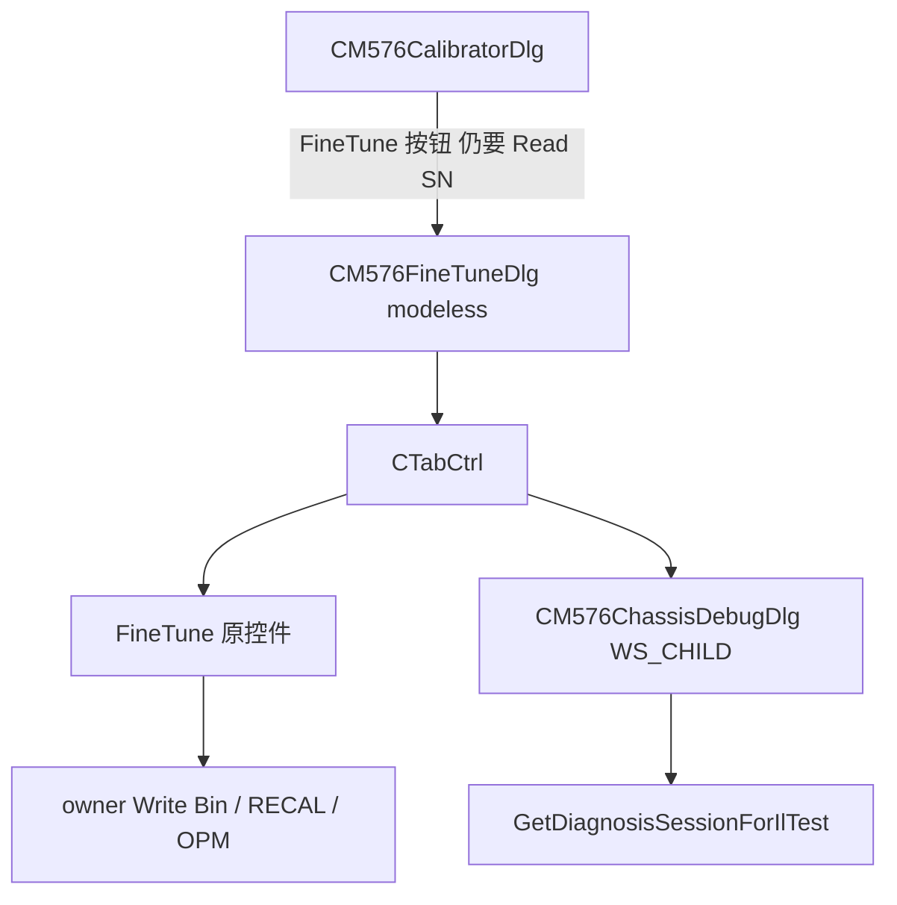

# FineTune 与 Chassis Debug 合并为 TAB

以 [M576FineTuneDlg](M576Calibrator/M576CalibratorApp/M576FineTuneDlg.h) 为唯一调试窗口（保持 modeless，Burn Flash 期间可挂着）。内部加 TAB：`FineTune` | `Chassis Debug`。Chassis 从独立 modal 改为 FineTune 的子对话框，逻辑类保留。



## 入口（按你的选择）

- 主窗口 **删除** Diagnosis 区的 `Chassis Debug` 按钮（[M576CalibratorApp.rc](M576Calibrator/M576CalibratorApp/M576CalibratorApp.rc) 约 L54），提示文字可拉宽填空。
- 只留 Actions 区 `FineTune`；[OnBnClickedFineTune](M576Calibrator/M576CalibratorApp/M576CalibratorDlg.cpp) 的忙检测、`ValidateSnBeforeBinOp`、输出目录检查 **不变**。
- 删掉 `OnBnClickedChassisDebug`、message map、`SyncSerialPortUi` 里对 `IDC_BTN_CHASSIS_DEBUG` 的 Enable，以及 [M576CalibratorDlg.h](M576Calibrator/M576CalibratorApp/M576CalibratorDlg.h) 声明。`IDC_BTN_CHASSIS_DEBUG` 可从 resource.h 去掉。

打开后默认落在 FineTune TAB。窗口标题改为 `FineTune / Chassis Debug`，避免只看到 DAC 补写。

## UI 结构（不拆 FineTune 业务类）

不做成 `CPropertySheet`（会打乱现有 `Create` / `PostNcDestroy` / `delete this`）。也不把 FineTune 800 行逻辑抽到新 Page 类。

1. [IDD_M576_FINE_TUNE](M576Calibrator/M576CalibratorApp/M576CalibratorApp.rc)：顶部加 `SysTabControl32`（`IDC_FT_TAB`，新 ID，例如 2260）。对话框高度大约 +22 DLU，现有 FineTune 控件整体下移，落在 TAB 客户区里。RC 中 TAB 写在控件之前，保证 FineTune 控件叠在 TAB 客户区之上。
2. 底部 `Close`（`IDCANCEL`）**始终显示**，不属于某一页。
3. [IDD_M576_CHASSIS_DEBUG](M576Calibrator/M576CalibratorApp/M576CalibratorApp.rc) 改为子页：

```
STYLE DS_SETFONT | DS_CONTROL | WS_CHILD
EXSTYLE WS_EX_CONTROLPARENT
```

去掉 `CAPTION` / `DS_MODALFRAME` / `WS_POPUP` / `WS_SYSMENU`，去掉页内 `Close`（关窗口走宿主 Close）。控件 ID 与 [M576ChassisDebugDlg](M576Calibrator/M576CalibratorApp/M576ChassisDebugDlg.cpp) 处理函数全部保留。

4. FineTune 宿主加 `WS_EX_CONTROLPARENT`，Tab 键能进 Chassis 子页。

## 代码改动

**[M576FineTuneDlg.h](M576Calibrator/M576CalibratorApp/M576FineTuneDlg.h) / .cpp**

- 成员：`CTabCtrl m_tab`；`CM576ChassisDebugDlg m_chassisPage`（值成员，不要 `new`/`delete this`）。
- `OnInitDialog`：`InsertItem` 两页（`FineTune`、`Chassis Debug`）；`m_chassisPage.Create(IDD_M576_CHASSIS_DEBUG, this)`；用 `m_tab.AdjustRect(FALSE, …)` 把子页摆进 TAB 客户区；默认隐藏 Chassis。
- `ON_NOTIFY(TCN_SELCHANGE, IDC_FT_TAB, …)`：遍历宿主子窗口，TAB / Chassis / Close 除外；FineTune 页显示其余控件、隐藏 Chassis；Chassis 页相反。
- `SetPmBusy` 时同时 `EnableWindow` Chassis 页（或提供 `IsPmBusy()` 给 Chassis 查询），避免同一 439F 口上 FineTune OPM/RDAC 与 Chassis `SW`/`pd 1` 交错。

**[M576ChassisDebugDlg.h](M576Calibrator/M576CalibratorApp/M576ChassisDebugDlg.h) / .cpp**

- 不再 `DoModal`。构造仍拿 `CM576CalibratorDlg*` 取 `GetDiagnosisSessionForIlTest()`。
- `OnOK`/`OnCancel` 空实现（避免子页 Enter/Esc 把宿主关掉以外的意外；Esc 仍由宿主 `OnCancel` → `DestroyWindow`）。
- 开关/读功率前增加与旧入口相同的忙检测：`m_pathRunning` / Read / Burn / Diagnosis / IL Test。会话未就绪时继续写本页 Log（不弹主窗口）。
- 日志仍只写 `IDC_CHASSIS_EDIT_LOG`，不与 FineTune 右侧 Log 混写。

**主窗口 PreTranslateMessage** 已对 FineTune 及其 `IsChild` 做 `IsDialogMessage`，Chassis 子页键盘无需再改。

## 不改动的范围

- FineTune 定标/写 BIN/Small Range/RECAL 路径逻辑、[FineTuneBinPatch](M576Calibrator/M576CalibratorApp/FineTuneBinPatch.cpp) 不动。
- Chassis 命令字不动：`SW 3 1` / `SW 4` / `SW 1 1|2` / `SW 2`（MCS2 `UI+32`）/ `pd 1` / `OPM 3 1`。
- 无算法变更，不跑 CrossPeakTest。
- 不新增独立“调试工具”宿主类。

## 验证

- 主窗口不再有 Chassis Debug；FineTune 未 Read SN 仍拒绝打开。
- FineTune 打开后可切 TAB；FineTune 页功能与现网一致（Refresh / Write Bin / Small Range / Read Before-After / RDAC）。
- Chassis 页切光开关、读 TLS/OPM，Log 只在该页。
- FineTune 点 Close 销毁整窗；主窗口 Destroy 仍走现有 `m_pFineTuneDlg->DestroyWindow()`。
- FineTune 读功率期间 Chassis 按钮不可用；主流程 Run Path / Burn 期间 Chassis 命令拒绝并写 Log。
