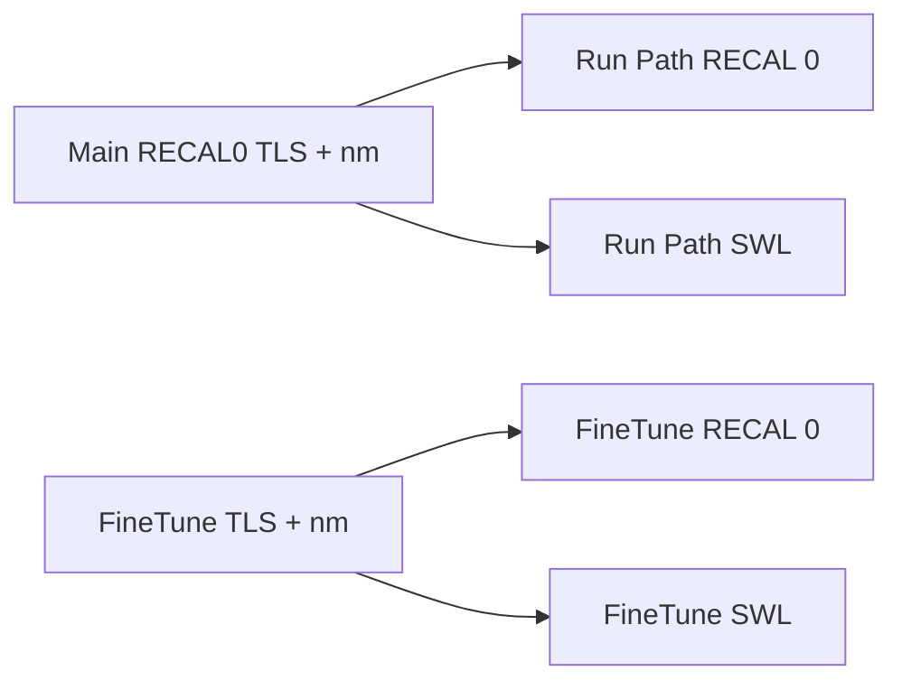

# SWL 跟 UI 绑定，FineTune 独立光源配置

当前分叉：`RECAL 0` 已用主界面 TLS（`m_tlsIndex + 1`），但随后 `SWL` 写死 `M576_DIAG_SWL_TLS_SOURCE`（8）。FineTune 读功率还从主界面读 TLS/波长，没有自己的光源配置。



`SWL` 第一参数就是光源通道（与主界面 `RECAL0 TLS` 同一含义），不是写死的「外部光源 8」。

Diagnosis / IL Test 仍用各自的 `SWL 8` + `SW 3 1` 场景，不改（那不是定标主流程）。

## 硬约束：FineTune 不得影响 Run Path

FineTune 只是调试旁路。改 FineTune **禁止**碰到 Run Path 的状态、命令顺序、重试/drain、CSV、LUT merge。

- 不写主界面 `m_tlsIndex` / `m_strWavelength` / `m_pmRangeIndex`。
- FineTune 读功率继续走独立函数 `FineTuneSwitchPathAndReadOpm`（显式传入本页 TLS/nm），**不要**改成调用 `ExchangeSwlBeforeRunPath`，以免把 FineTune 的超时/重试掺进 Run Path。
- `ExchangeSwlBeforeRunPath` 只给 Run Path PM/PD 用；本次仅增加 `tlsSource` 参数，drain / settle / 重试次数不动。
- Small Range 仍启动主界面 PM Run Path，继续用主界面 TLS/nm，不读 FineTune 下拉。
- RDAC / Write Bin / Chassis Debug 本页 SWL 不改 Run Path。

## 1. 主界面定标：SWL 跟 TLS 下拉

改 [ExchangeSwlBeforeRunPath](M576Calibrator/M576CalibratorApp/M576CalibratorDlg.cpp) 增加 `tlsSource` 参数，去掉内部的 `M576_DIAG_SWL_TLS_SOURCE`：

```cpp
BOOL ExchangeSwlBeforeRunPath(int tlsSource, int wavelengthNm, CString& err);
```

- 校验 `tlsSource` 在 `M576_MIN_TLS_SOURCE`..`M576_MAX_TLS_SOURCE`。
- `FormatSwlWire` / 日志改为 `SWL <tls> <nm>`，去掉 “external / SWL 8” 文案。
- PM Run Path：RECAL 0 之后传入已有的 `tlsSource`（`m_tlsIndex + 1`）。
- PD Run Path：同样传入 `m_tlsIndex + 1`（PD 不发 RECAL 0，但仍要 SWL 设波长）。

声明与注释同步改 [M576CalibratorDlg.h](M576Calibrator/M576CalibratorApp/M576CalibratorDlg.h) 约 L280。

`M576_DIAG_SWL_TLS_SOURCE` 留给 Diagnosis 固定场景，FineTune/Run Path 不再用。

## 2. FineTune：独立 TLS + 波长

在 FineTune 页 PM 区增加与主界面同类、但互不影响的两个下拉：

- TLS：1..8，默认 8（`M576_DEFAULT_TLS_SOURCE`）
- nm：1310 / 1550，默认 1310

控件放进 [IDD_M576_FINE_TUNE](M576Calibrator/M576CalibratorApp/M576CalibratorApp.rc) 的 `IDC_FT_GROUP_PM`：第一行 TLS + nm，第二行现有 Read Before/After / RDAC。组高度略增，不占用 Chassis TAB。新 ID：`IDC_FT_COMBO_TLS`、`IDC_FT_COMBO_WL`。

打开 FineTune 时用上述默认值初始化，**不**从主界面拷贝，之后改主界面也不影响已打开的 FineTune。

[FineTuneSwitchPathAndReadOpm](M576Calibrator/M576CalibratorApp/M576CalibratorDlg.cpp) 增加参数，不再 `UpdateData` 读主界面：

```cpp
BOOL FineTuneSwitchPathAndReadOpm(
    const SPathStep& step,
    int tlsSource,
    int wavelengthNm,
    double& outDbm, int& outRaw, CString& err);
```

函数内 `RECAL 0` 与 `SWL` 都用传入的 `tlsSource` / `wavelengthNm`。PM 挡位仍强制 AUTO（4），与现在一致。

[ReadPmSlot](M576Calibrator/M576CalibratorApp/M576FineTuneDlg.cpp) 从本页 combo 取值再调用；非法 TLS/波长只写 FineTune 本地 Log 并提示，不发命令。

RDAC 1/4、Write Bin 不改。Small Range 仍走主界面 Run Path（主界面 TLS/nm）。Chassis Debug 页已有独立 TLS/波长，也不改。

## 验证

- 主界面 TLS=3、nm=1310 点 Run Path：日志为 `RECAL 0 TLS=3` 且 `SWL 3 1310`，不再出现 `SWL 8`。
- FineTune TLS=1、nm=1550，主界面仍为 8/1310：Read Before 日志为 `RECAL 0 TLS=1 nm=1550` 和 `SWL 1 1550`。
- 主界面改 TLS 后，已打开的 FineTune 下拉不变；FineTune 改 TLS 后，主界面 TLS/nm 与随后 Run Path 的 `SWL` 不变。
- Diagnosis 仍为 `SWL 8`。
