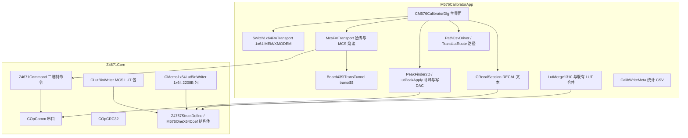

# M576Calibrator 开发设计与代码说明

本文档基于当前仓库中 `M576Calibrator` 解方案内源码整理，用于**架构说明、模块职责、类/方法索引**与后续维护沉淀。细节以头文件与实现为准；`Z4767StructDefine.h` 体量较大，此处只概括其在流程中的角色。

**读者**：固件/上位机对接、产线软件维护、二次功能扩展。

**对表与不变量**（改 Merge / RECAL / Read 前必读）：

| 文档 | 用途 |
|------|------|
| [`INVARIANTS.md`](INVARIANTS.md) | 不可违反的 INV-xx 条文（SN33/34、CH19�C32、重试、Read） |
| [`LUT_INDEXING.md`](LUT_INDEXING.md) | SN / sw / ch / MCS 块号对照表 |

---

## 1. 文档范围与解方案

| 工程 | 类型 | 作用 |
|------|------|------|
| **Z4671Core** | 静态库（.lib） | 与 Z4671/控制板 相关的**串口、二进制指令、LUT/MEMS bin 落盘、CRC/字节序、通信重试**等可复用能力；不依赖 MFC 对话框。 |
| **M576CalibratorApp** | MFC 可执行文件 | 1310nm 定标**上位机 UI 与业务编排**：单串口连 439F、ASCII RECAL 定标、经 `trans`/`$$` 隧道的读 Flash/烧录、路径 CSV、寻峰、统计导出等。 |
| **CrossPeakTest**（同目录，可选） | 控制台/测试工程 | 针对寻峰等算法的独立验证，非产线主程序依赖链核心。 |

工程依赖关系：**M576CalibratorApp 依赖并链接 Z4671Core**（`M576Calibrator.sln` 中已配置项目依赖）。

---

## 2. 总体架构

- **同一条物理串口**：`COpComm` 打开后，**ASCII 层**由 `CRecalSession` 发 `RECAL ...`；**透传**到某 `trans` 通道后，**二进制层**用 `Z4671Command` 与下位机 Z4671 风格帧通信（与 `Board439fTransTunnel` 配合必须先 `trans n` 再发二进制，结束用 `$$`）。

---

## 3. 工程一：Z4671Core

### 3.1 设计目标

- 从 Z4671 时代继承并收敛：**串口读写、命令帧、硬件信息/开关/光放等指令**（见 `Z4671Command`）。
- 为 M576 定标提供 **可链接的、无 UI 的** 能力：`stLutSettingZ4671` 的合包写盘、1x64 `stM576OneX64MemsSwCoef` 的 2208B 合包、CRC 与多字节序。
- **通信可观测性**：`CommLog.h` 的 `M576CommLogTarget` 将收发文本/错误回调给上层，便于 M576 写盘日志和 UI 脱钩。

### 3.2 头文件与文件职责（核心）

| 文件 | 说明 |
|------|------|
| `stdafx.h` / `stdafx.cpp` | 预编译头。 |
| `OpComm.h` / `OpComm.cpp` | **`COpComm`**：打开/关闭串口、`ReadBuffer`/`WriteBuffer`（含不 Purge 的变体，供 ASCII 请求响应）、`RxBytesWaiting` 等。`Z4671Command` 公有继承此类。 |
| `CommPort.h` | `CCommPortRef`：对 `COpComm` 的薄包装，预留给可替换实现/测试。 |
| `Z4671Command.h` / `Z4671Command.cpp` | **`Z4671Command`**：在 `COpComm` 之上实现大量 **CMD_*** 与业务方法（如 `SetSwitchDAC`、`GetLogFileData`、EDFA/VOA/光开关/固件升级等）。M576 场景主要用 **透传、读 log 文件/Flash、发扫描、固件分片** 等。内置 **通信日志/帧 trace**（`SetCommLogTarget`、`TraceInfo`/`TraceError`/`TraceFrame` 等）。 |
| `Z4767StructDefine.h` | 与产品/Z4671 软件兼容的**大型结构体定义**（如 `stLutSettingZ4671`、端口/温区/校验等）。定标只写其中 **低温槽 `wCalibPtrDAC`** 等子集，以业务代码为准。 |
| `M576OneX64Coef.h` / `M576OneX64TempMeta.h` | **1x64 单开关 2208B 文件/Flash** 布局与 `stM576OneX64MemsSwCoef` 镜像；与 126S 固件 `tagMemsSwCoef` 对齐。`M576OneX64ApplyStandardTempMeta` 在写 2208B 前填充标准温区等元数据。 |
| `LutBinWriter.h` / `LutBinWriter.cpp` | **`CLutBinWriter`**：按 Z4671 **CreateBinFileZ4671** 布局写 MCS **LUT 合包**（`SLutBinWriteParams`：路径、SN/PN/时间、镜像基址、`stLutSettingZ4671*`）。提供 `LutPayloadOffset`、从文件只读 LUT 体、`ReadBundleSnFromFile`、设备 payload 尺寸等。 |
| `Mems1x64LutBinWriter.h` / `Mems1x64LutBinWriter.cpp` | **`CMems1x64LutBinWriter`**：单开关 2208B 文件（BUNDLEHEADER + 2048 body、CRC 规则在注释中说明）、读回单文件到结构体。 |
| `OpCRC32.h` / `OpCRC32.cpp` | **`COpCRC32`**：与 bin 中 CRC 字段计算一致的表驱动 CRC。 |
| `ByteSwap.h` | 多字节字序/主机与线格式转换辅助。 |
| `CommLog.h` | `M576CommLogTarget`、**按行/格式化/十六进制/ASCII 转义** 等，供 RECAL 与 `Z4671Command` 共用。 |
| `CommRetry.h` | **`M576WithRetry`**：泛型 Polly 式重试模板，默认与 `M576CalibratorApp` 中重试常数可配合（宏 `M576_COMM_RETRY_*`）。 |

### 3.3 类与方法说明

#### 3.3.1 `COpComm`（`OpComm.h`）

- **职责**：Win32 串口句柄封装，**原始字节**收发；不负责协议拼帧。
- **主要方法**  
  - `OpenPort` / `ClosePort`：打开/关闭。  
  - `ReadBuffer` / `WriteBuffer`：多种重载；注意 Z4671 用 `ReadBuffer(..., WORD*)` 避免 /RTC1 与长度形参混用。  
  - `WriteBufferNoPurge`：发 ASCII 后需保留 RX 队列，避免误 Purge。  
  - `RxBytesWaiting`：长 RECAL 扫频行时配合 drain/读满。

#### 3.3.2 `Z4671Command`（`Z4671Command.h`）

- **基类**：`COpComm`。  
- **公开数据成员（节选）**：`m_pNewData` 等缓冲区、`m_stModuleInfo`、`m_stScanPara`、产品侧电压/报警缓存等。  
- **M576/定标常涉及方法**（与完整产线/EDFA/VOA 等并存，下表**非全量**）：  

| 类别 | 方法示例 | 说明 |
|------|----------|------|
| 开关/扫描 | `SetSwitchDAC`, `GetCurrentDAC`, `SendScanTrig`, `SendScanDoubleTrig`, `SwitchSingleSwitch`, `GetSingleSwitchState`, `SwitchALLSwitch` | 设置/查询 MEMS/开关与 DAC 扫描。 |
| 光功率/PD/温度 | `GetProductPDPower`, `GetProductPDADC`, `GetPDPower`, `GetEDFATemp`, `GetMCSTemp`, `GetMCSAlarm` 等 | 与功率计/PD/模块状态相关。 |
| 固件/文件 | `StartFWUpdate`, `SendFWTranSportFW` / `FWTranSportFW`, `FWUpdateEnd`, `GetLogFileData` 等 | Flash 分片传输与 log 区读取（M576 的 MCS 上载/读回路径会调此类）。 |
| 信息 | `GetProductSN`/`PN`/`ID`, `GetMCSVersion`, `GetEDFAInfo` 等 | 设备标识与版本。 |
| 其他 | `CmdSendExchange`/`CmdReadExchange` | 更通用的帧交换入口（内部仍走协议封装）。 |
| 日志与诊断 | `SetCommLogTarget`, `TraceInfo`, `TraceError`, `GetErrorMsg` | 与 `M576CommLogTarget` 及帧 trace 配合。 |
| 辅助 | `SetScanDelayTime` | 扫描间隔。 |

- **注意**：`Z4671Command` 中命令码宏（`CMD_HW_*` 等）体量大，**M576 专用 RECAL 文本**不在本类，而在 **M576CalibratorApp 的 `CRecalSession`**。

#### 3.3.3 `CLutBinWriter`（`LutBinWriter.h`）

- **单例式静态类**：`Write` 写完整合包；`LutPayloadOffset` 等描述磁盘布局。  
- **主要静态方法**  
  - `Write`：入参 `SLutBinWriteParams`。  
  - `ReadLutFromFile`：从已有 bin 只解析 LUT 体。  
  - `ReadBundleSnFromFile`：读合包头 SN。  
  - `FullBundleFileSize` / `LutDevicePayloadSize`：文件总大小与设备允许的 LUT payload 大小区分。

#### 3.3.4 `CMems1x64LutBinWriter`（`Mems1x64LutBinWriter.h`）

- `WriteSingleSwitch`：一开关 2208B 输出。  
- `ReadMemsFromFile`：读入 `stM576OneX64MemsSwCoef`。  
- `ReadBundleVer16FromCoef`：从结构体中读 16 字节 version 串。  
- 另见文件内 **`M576OneX64ApplyStandardTempMeta`（C 链接函数）**。

#### 3.3.5 `COpCRC32`（`OpCRC32.h`）

- `InitCRC32`、`GetThisCRC`（单字节步进）、`GetCRC`（整缓冲）：为 LUT/合包与设备约定多项式 `POLYNOMIAL`。

#### 3.3.6 `CCommPortRef`（`CommPort.h`）

- 对 `COpComm` 的引用封装；当前业务路径多为直接使用 `COpComm` / `Z4671Command`。

#### 3.3.7 模板与工具

- `CommRetry.h`：`M576WithRetry` 多重重试。  
- `M576CommLogTarget` + `M576HexDump` / `M576EscapeAscii`：日志可观测与调试。

---

## 4. 工程二：M576CalibratorApp

### 4.1 设计目标

- 单主对话框 **`CM576CalibratorDlg`** 驱动全流程：**开串口 → 选 PM/PD 模式与参数 → 跑路径 CSV（RECAL 0/1/2 + 3 或 5 二维扫）→ 寻峰 → 把交叉峰处 DAC 写入内存中的 LUT 或 1x64 四块结构体 → 生成/合并 bin → 可选读回备份与分文件烧录**。
- **不阻塞 UI**：长任务进 `std::thread`，通过自定义消息/队列刷日志与进度条（头文件注释中有说明）。
- **通信分层**：ASCII（`CRecalSession`）与二进制+透传（`McsFwTransport` / `Board439fTransTunnel` / `Switch1x64FwTransport` + `Z4671Command`）明确分离。

### 4.2 入口与资源

- **`CM576CalibratorApp`**（`M576Calibrator.h` / `M576Calibrator.cpp`）  
  - 标准 MFC `CWinAppEx`：初始化实例、主对话框。  
- **`M576CalibratorDlg`**：主业务所在（`.h` 声明了成员、工作线程、消息与大部分私有方法；`.cpp` 体量很大，**以头文件分块注释为准**）。

### 4.3 类与Free函数模块（按文件）

#### 4.3.1 `CM576CalibratorDlg`（`M576CalibratorDlg.h` / `.cpp`）

| 方面 | 说明 |
|------|------|
| 串口与设备 | `Z4671Command m_dev429f`；`CRecalSession` 的 `unique_ptr` 在打开串口时绑定到同一 `COpComm` 基引用。 |
| 内存态 LUT/MEMS | `m_lutByTrans[4]`：trans1�C2 为 MCS 用 `stLutSettingZ4671`；trans3�C4 在逻辑上映射到 `m_mems1x64[2][4]`（两路 1x64 × 每路四开关 2K）。 |
| 后台线程 | `PathWorkerEntry`（定标路径）、`ReadFlashBackupWorkerEntry`（读备份）、`ReadAllSnWorkerEntry`（读 SN）、`BurnFlashWorkerEntry`（分文件烧录）等。 |
| UI 与线程安全 | `SafeAppendLog`、`OnPathLogFlush`、进度 `SafeSetProgressPos`、以及多种 `OnXxxFinished` 在 UI 线程收结果。 |
| 定标子流程 | `RunPathPowerMeter` / `RunPathPd`、按分文件 `RunPathPowerMeterFile` / `RunPathPdFile`；与 `m_nCalMode`、`m_dacRange`、`m_dacStep`、`m_delayMs` 等绑定。 |
| 其它 | `TryPreloadLutFromPerTransBackup`、`ValidateRunPathInputs`、`ProgressThunk` / `CommLogThunk` 静态回调等。 |

**与界面按钮/消息**（节选）：`OnBnClickedOpenPorts`、`OnBnClickedRunPath`、`OnBnClickedGenBin`、`OnBnClickedReadFlashBackup`、`OnBnClickedFlash`、`OnBnClickedReadAllSn`、`OnBnClickedExportCalibStats`、`OnBnClickedStop` 等，配合 `WM_M576_PATH_*` 系列自定义消息（见头文件 `afx_msg` 声明）。

#### 4.3.2 `CRecalSession`（`RecalSession.h` / `.cpp`）

- 封装与 439F 的 **RECAL 文本协议**（`SendRecal0` 命令 A、`SendRecal1` B、`SendRecal2` C、`SendRecal3`/`5` 扫频）。  
- `ExchangeRecal*ReadLine` / `ExchangeRecal*ReadSweep`：带重试的“发+收”一体。  
- 静态解析：`ParsePowerDoubles`、`ParseRecal3SweepLine`（扫频行首值为固定轴 DAC，余为动轴上采样）。  
- 内部：`ReadAsciiResponse`、`ReadAsciiSweepResponse`、超时栈 `PushCommTimeouts`/`PopCommTimeouts`、`WriteNoPurgeReliable` 等，保证**可靠行读与可重复日志**。

#### 4.3.3 `McsFwTransport`（`McsFwTransport.h` / `.cpp`）

- **MCS 侧**经 `trans`+二进制：`McsFwUploadBin` / `McsFwUploadBinEx`（`M576_BURN_FILE_COUNT=10` 个分文件可选掩码）、`McsReadLutBundleFromDevice`、`McsReadAllTransProductSn`。  
- 路径与命名：`M576TransBackupPathFromBase`、`M576TransBinPathForRead`、`M576TransBinPathForSwitch`（新命名 + 老 `*_tN.bin` 回退见注释）。  
- 类型 `M576TransSnPnInfo`：MCS/1x64 的 SN 缓存供写头与读回。  
- `McsFwProgressCb`：上载/读回进度，**`__cdecl`** 以与界面 thunk 一致。

#### 4.3.4 `Switch1x64FwTransport`（`Switch1x64FwTransport.h` / `.cpp`）

- trans3/4 上 **1x64**：MEM 协议读 4×2048 body、组 2208B、XMODEM 下发。  
- `M576Read1x64MemsBinOnCurrentTunnel`、`M576Upload1x64MemsBinOnCurrentTunnel`、`M576Read1x64SnAllOnCurrentTunnel` 等；`M5761x64MemReadStepCount` 等辅助。

#### 4.3.5 `Board439fTransTunnel`（`Board439fTransTunnel.h` / `.cpp`）

- `BeginTrans` / `EndTrans`：发 ASCII `trans <n>` 与 `$$` 进入/退出透传，期间后续字节发往当前隧道指向设备。

#### 4.3.6 `PathCsvDriver`（`PathCsvDriver.h` / `.cpp`）

- 结构体 **`SPathStep`**（PM/RECAL 1）：`targetSwitchIndex` + 四路通道 `c1..c4`（1#1x64 / 1#MCS / 2#MCS / 2#1x64 顺序，见头注释）。  
- **`SPathStepPd`**（PD/RECAL 2）：三参数形态，target 与 ch1 半区隐含 Stage/MCS 银行（见头注释）。  
- `LoadPathCsv` / `LoadPathCsvPd` + `ValidatePathStep` / `ValidatePathStepPd`。

#### 4.3.7 `TransLutRoute`（`TransLutRoute.h` / `.cpp`）

- `TransSlotFromPmTarget` / `TransSlotFromPdTarget`：把 RECAL 目标号映射到 **trans 槽 0~3**。  
- `PmStepMatchesFileSlot` / `PdStepMatchesFileSlot`：判断该步是否属于某分 CSV/分文件 slot。

#### 4.3.8 `LutPeakApply`（`LutPeakApply.h` / `.cpp`）

- `PeakGridToDacWord`：由峰格行列、`halfRange`、格起点，计算交叉峰处 **X/Y 线性整数**，**钳位到 int16 后以 16 位二补码**写入 `WORD`/`short` 语义。  
- `ApplyRecalPeakToLut` / `ApplyRecalPeakToLutPd`：按目标（MCS 的 swIdx/ch 或 1x64 在 LUT 中占位等）把 DAC 对写入 `stLutSettingZ4671`。  
- `ApplyRecalPeakToMems1x64` / `ApplyRecalPeakToMems1x64Pd`：写入 1x64 四块中的 **低温档** `stCalibDAC[0].stChnDAC[].sDACx/y`。

#### 4.3.9 `PeakFinder2D`（`PeakFinder2D.h` / `.cpp`）

- 命名空间 `M576`：`PeakCross2D`、`PeakMax2D`、`PeakMax1D`、`PeakCrossFrom1DScans`（两次一维扫得到离散交叉峰索引）。

#### 4.3.10 `LutMerge1310`（`LutMerge1310.h` / `.cpp`）

- `MergeLut1310LowTempSlot`：在已有 `base` LUT 上，仅用 **1310 定标产物的低温槽**覆盖。  
- `MergeMems1310LowTempSlot`：1x64 四块 2K 的低温档 `stChnDAC[IDX_LOW]` 级合并（具体索引与 `IDX_TEMP_LOW` 一致，见实现）。

#### 4.3.11 `CalibWriteMeta`（`CalibWriteMeta.h` / `.cpp`）

- `SCalibrationStatRow`：一次定标步的**元数据**（模式、trans、峰行列、格尺寸、raw/写入 DAC、结构体路径与偏移等）。  
- `CalibBuildStatRowPmLut` / `PmMems` / `PdLut` / `PdMems`：在 PM/PD × MCS/1x64 组合下填充行。  
- `WriteCalibrationStatsCsv`：UTF-8 BOM + 列头 + 多行，供导出按钮使用。

#### 4.3.12 `CM576BurnSelectDlg`（`M576BurnSelectDlg.h` / `.cpp`）

- 十路分文件烧录的**复选**对话框；`GetMask` 返回 `std::array<bool, M576_BURN_FILE_COUNT>` 供 `McsFwUploadBinEx` 使用。

#### 4.3.13 其它

- `CalibConstants.h`：M576 与 439F/固件约定常量（RECAL 参数、超时、分 trans 通道表、格点默认等）；**改宏前需与固件/产线确认**。  
- `M576Calibrator.h` / `M576Calibrator.cpp`：应用对象与 `InitInstance`。  
- 资源与对话框 ID：`resource.h`（不展开）。

### 4.4 定标与 bin 的端到端数据流（摘要）

1. 用户选 CSV → `LoadPathCsv*` 得到 `SPathStep( /Pd)` 数组。  
2. `RunPath*` 循环每步：必要时 `RECAL 0/1/2` → 两次 `RECAL 3` 或 `5` 得功率矩阵 → `PeakCrossFrom1DScans` 等得 `(peakRow,peakCol)`。  
3. `PeakGridToDacWord` 得 DAC 对；`ApplyRecalPeakToLut` 或 `ApplyRecalPeakToMems1x64*` 更新内存。  
4. 生成时：`CLutBinWriter::Write` 写 MCS 分文件；`CMems1x64LutBinWriter` 写各开关 2208B；`LutMerge1310*` 在需要时与基线 bin 合。  
5. 烧读：`McsFwUploadBinEx` / `McsReadLutBundleFromDevice` + 1x64 专用 `Switch1x64FwTransport`，均依赖此前 **`Board439fTransTunnel` 进 trans**。

### 4.5 输出目录：`latest` 工作区与 `archive` 归档

| 路径 | 用途 |
|------|------|
| `output\latest\` | 当前读写工作区：`{SN}_backup.bin` / `{SN}_standard.bin`、DAC CSV（`ResolveBinOutputDirAbs`） |
| `output\archive\{YYYYMMDD_HHMMSS_MCS1SN}\` | Read SN 成功时创建；`backup/`、`standard/`、`pre_burn/` 为各阶段快照 |
| `output\pm_*.csv` / `pd_*.csv` | 不变，仍在 `output\` 根目录 |
| `output\comm_YYYY-MM-DD.log` | 不变；归档时复制到 `archive\...\logs\comm_*.log` |

实现：[`M576OutputArchive.h/.cpp`](../M576CalibratorApp/M576OutputArchive.h)（`M576ArchiveCopyBinSet`、`M576WriteSessionMeta`）；挂钩在 `CM576CalibratorDlg::BeginArchiveSession` / `ArchiveCurrentBinSet`（Read SN、Read Flash、Write BIN、Burn 前）。归档失败仅 Warn 日志，不阻断主流程。

---

## 5. CrossPeakTest 工程

- 小工程，用于在**无整 UI** 情况下验证 `PeakFinder2D` 或相关逻辑（`main.cpp`），便于算法回归；**不替代** M576 主程序集成测试。

---

## 6. 维护与扩展建议

- **M576CalibratorApp 源文件编码**：工程 `CharacterSet=MultiByte` 且编译选项 `/utf-8`；`.cpp` 以 **UTF-8（无 BOM）** 保存，中文仅写在 `//` 注释中。例外：`Board439fFwBurnTransport.cpp`、`CalibWriteMeta.cpp` 保留 **UTF-8 BOM**，编辑时不要去掉 BOM 以免整文件 diff。
- **改通信超时/重试**：优先查 `CalibConstants.h` 与 `CommRetry.h`、以及 `CRecalSession` 中 `M576_COMM_RETRY_*` 的用法。  
- **改 DAC 语义**：以 `LutPeakApply.cpp` 与 `CalibWriteMeta` 中 **WORD 的二补码解释** 为准，并与固件对拍。  
- **新增 trans 或路径规则**：改 `TransLutRoute` + 常量表 + 对话框里文件 slot 规则，**避免在 UI 里写死**协议字符串。  
- **Z4671 指令扩展**：在 `Z4671Command` 中增加方法时保持与现有 **帧格式/校验/日志** 模式一致，并在 `McsFwTransport` 中只做编排、不拼错二进制边界。

---