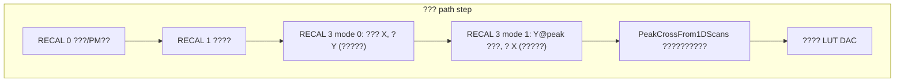
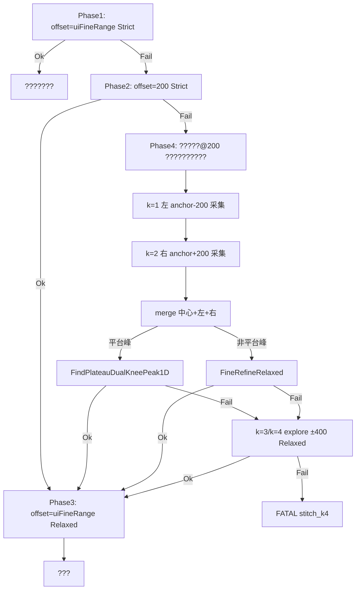
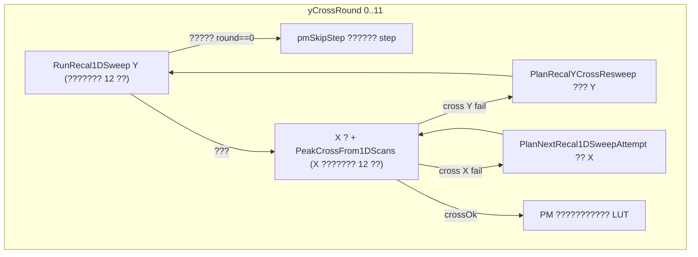

??# M576 ??????????PeakFinder??

???????? M576 1310nm ?????????**?????????**??????????????????????????????????????????????????????????????

**???????**

| ??? | ??? |
|------|------|
| [`INVARIANTS.md`](INVARIANTS.md) | INV-10..19 ???/RECAL ?????????? |
| [`DEVELOPMENT_AND_CODE_GUIDE.md`](DEVELOPMENT_AND_CODE_GUIDE.md) | ??????????? |
| [`?????TODO.md`](?????TODO.md) | ??????? backlog |
| [`PeakFinder??????????.png`](PeakFinder??????????.png) | ?????????????? |

**???????**???? `CLAUDE.md` / `m576-global.mdc` ??????????????? base?????????????????**???????????????????????????????????????????**?????????????/??????????????????????

---

## 1. ?????????? 1D ?? + ????????

PM/PD Run Path ??????**????**???? DAC ?????????? 2D ???k?????

1. `RECAL 0` ?? ??????? / PM ????  
2. `RECAL 1` ?? ???????? MEMS ???  
3. **`RECAL 3` mode 0** ?? ??? X??`baseX=9999`????? Y ?? **?????Y ????**  
4. **`RECAL 3` mode 1** ?? ??? `baseY=Y@peak`??? X ?? **?????X ???**  
5. **`PeakCrossFrom1DScans`** ?? ?????????????????? 1D ???????????????? `(row, col)` ?? DAC  
6. ???? LUT ???????  

??PD ??????? `RECAL 5`???????? `RECAL 3` ??????? INV-18????



### 1.1 ???????????INV-18??

6 ?? ASCII ??????

```text
RECAL 3 {mode} {baseX} {baseY} {offset} {step} {delay}
```

| mode | ???? | baseX | baseY | ???????????? |
|------|------|-------|-------|-------------|
| **0** | ??? X??? Y | `9999`?????????? LUT?? | `movingBase`???????? | Y |
| **1** | ??? Y??? X | `movingBase`???????? | `Y@peak`?????????? | X |

- `offset`???? DAC ??????UI ??? `m_dacRange`??????????? 200??  
- `step`??????????`m_dacStep`??  
- `delay`???????????`m_delayMs`??  

????????????`[col0] P1 P2 ... Pn`?????? raw ?????????? `-999999` ?? `-999900`??INV-14????

---

## 2. ????????Y ????????

?? MEMS ??????????**Y ??????????????????**??X ????? **Y ??????** ??????????????????????????????????????^

| ???? | ????? Y ??????? |
|------|---------------------|
| Y ?? `RunRecal1DSweepWithPeakRecenterRetry` ????`yCrossRound==0`?? | `pmSkipStep=TRUE`??**???? RECAL 3 1**???? step ??????path ????????? |
| Y ?? Strict ?????????????? Y ????? | `PlanRecalYCrossResweep` **??????? Y**?????? 12 round????????? X ???????? |
| Y cross OK???? X cross ??? | **???? X**??`PlanNextRecal1DSweepAttempt` on X????`fixedY` ????????? Y |
| Y@peak ???? | X ????? Y ??? ?? ??????????????LUT ???? |

**????**???????????????? `RECAL 3 0` ?? attempt ??????trend??baseY/offset ?????X ?????????? Y ???????????????

????????`M576CalibratorDlg.cpp` ?? PM/PD ?????????? `yCrossRound` ??????? + `RunRecal1DSweepWithPeakRecenterRetry` ????????

---

## 3. ????????????????

| ?? | ??? | ??? |
|----|------|------|
| **1D ????/????** | `PeakFinder2D.cpp` / `PeakFinder2D.h` | `ParabolaVertexMax1D`??`PeakCrossFrom1DScans`??`Peak1DValidateCode`??`Peak1DFitPolicy` |
| **??????** | `Peak1DSweepRecenter.cpp` / `Peak1DSweepRecenter.h` | `PlanNextRecal1DSweepAttempt`??`PlanRecalYCrossResweep`??`AnalyzeRecal1DSweepProfile`??recenter ????? |
| **????** | `M576Peak1DConstants.h` | ?????max attempts??coarse range???? `CrossPeakTest` ???? |
| **PM ???????** | `PmRangeValidation.cpp` | `ValidatePeakPowerInPmRange`???? RECAL 3 PM ?????? |
| **???????** | `M576CalibratorDlg.cpp` | `RunRecal1DSweepWithPeakRecenterRetry`??cross ??????LUT ???? |
| **???????** | `CrossPeakTest/main.cpp` | comm CSV ????planner ?????????? |

**??????**??bin ????/CRC ?? `Z4671Core`??????????? App ?????? Dlg ???????????? `M576Peak1DConstants.h`????

---

## 4. ??????`ParabolaVertexMax1D`

??????????????? `P1..Pn`???????????????? `t*`????????????????????? DAC??

### 4.1 ?????????


1. **????????**??`-999999` / `-999900` ?????? span/????INV-14????  
2. **???????Strict??**?????????? useOk ?? `max?min >= MinProminenceDb`????? 0.3 dB??`Peak1DMinFlatSpanRaw()`??INI `MinProminenceDb` ?????????????? `ParabolaNotDownward`??  
3. **?????**????????????? ?? `FindProminenceSymmetricWindow` ?????????????????????/????????Z?????  
4. **????????**??`P(i) ?? a??i? + b??i? + c??i + d`??????????????????????? `t*`??  
5. **Strict ???????**??`Peak1DFitPolicy::Strict`????  
   - ?????????????????? ?? `ParabolaNotDownward`  
   - ????????`MIN_FIT_SPAN_FRAC`??  
   - ??????????????????/???  
   - `t*` ???? `[0, n?1]` ?? `VertexOutOfRange`  
   - `M576_PEAK1D_REJECT_EDGE_MAX=0` ?**????**??????????????  
   - ?????????? ?? `ParabolaNotDownward`  

### 4.2 ???????????

| ???? | ??????? | ???? Strict ???? |
|------|----------|-------------------|
| **`Strict`** | ????????JumpFlatMax??MonoCoarseShift??FlatAtMaxShift??ShiftOnly | ??????????? |
| **`FineRefineRelaxed`** | ??? OK ???? UI fine range ???????????????????? fine range | ???? ?????????????????????????????????????????????/`VertexOutOfRange` ?? **argmax ????** |

?????????`IsFineRefineSweepAttempt(state)` ?? `Peak1DFitPolicyForSweepResult` / `Peak1DFitPolicyForCrossAxis`??

### 4.3 `Peak1DValidateCode` ????

| ???? | ???? | ???? recenter ???? |
|------|------|-------------------|
| `Ok` | ?????? | ?? |
| `Empty` / `LowSpan` | ???????????? | Flat ??? / ?? range |
| `ParabolaNotDownward` | ???????????????????? | ?? trend??Flat??JumpFlatMax??StrictInc/Dec??MonoCoarseShift |
| `VertexOutOfRange` | `t*` ????? | ShiftOnly / FlatAtMaxShift????????????? |
| `EdgeNotAllowed` | ???????????`REJECT_EDGE_MAX=1` ??? | ? VOR |
| `NotEnoughValidSamples` | ??????????????? | Mono ??? |
| `PmRangeMismatch` | PM ???????????INV-16?? | **??????**????????? |
| `ParabolaFitSingular` | ????]?????? | Relaxed ?? argmax ???? |

???????? `PeakFinder2D.h`??

### 4.4 ?????????`SweepTrend`

`AnalyzeRecal1DSweepProfile` ???????????????????? planner ??????

| trend | ??????? | planner ???? |
|-------|----------|-------------|
| `Flat` | span ???????????????? | JumpFlatMax ?? FlatAtMaxShift |
| `StrictInc` | ???????????? | MonoCoarseShift?????????? |
| `StrictDec` | ???????????? | MonoCoarseShift?????????? |
| `NonMono` | ???????????? | ???? argmax ?? ShiftOnly????? ?? FineRefine |

---

## 5. ??????????? pipeline??INV-10 / INV-11 / INV-12??

???????????**???????**???????????`RunRecal1DSweepWithPeakRecenterRetry` ?? **`Peak1DSweepPipeline`** ??????????`Peak1DSweepPipeline.cpp`????????? `PlanNextRecal1DSweepAttempt` ?????????

### 5.1 ???????? 6 ?????????



| ???? | ? |
|------|-----|
| UI ?? | `m_dacRange`????? 64?? |
| ????? | `M576_MAX_DAC_RANGE` = 200 |
| ????? | `m_dacRange / 2`??64??32?? |
| 对称拼接 | k=1 左 anchor−200、k=2 右 anchor+200（k=1 不 merge） |
| 扩展摸索 | k=3/k=4 anchor±400；仅 FineRefineRelaxed |
| 合成寻峰 | 平台峰 `IsMergedMesaProfile` → **FindPlateauDualKneePeak1D**；否则 Relaxed |

**????**??`PmRangeMismatch`??INV-16???????/????????Dlg???? FATAL????**???????**??`[FATAL][peak-pipeline]` + `m576_fatal.log`??INV-15????

### 5.2 ???? API

| ???? | ??? |
|------|------|
| `InitRecal1DSweepPipeline` | ?? Fine64 ????? |
| `GetNextPipelineSweepCommand` | ????? base/offset/policy |
| `AdvanceRecal1DSweepPipeline` | ???????????????? |
| `MergeRecal1DSweepSegments` | DAC ????????????????? |
| `FindPeakDacOnMerged` | 对称三段 merge：`IsMergedMesaProfile` → dual-knee；否则 Relaxed；k≥3 扩展仅 Relaxed |
| `BuildPeakPipelineFailureReport` | FATAL ?????? |

### 5.3 ?? planner

`PlanNextRecal1DSweepAttempt` / `SuggestFallbackSweepRetryPlan` **?????**?? `CrossPeakTest` ????? comm CSV ?????**???? Dlg ???????**??

---

## 6. ??????????`PeakCrossFrom1DScans`

Y ???? X ??????????????????????**???**???? `ParabolaVertexMax1D`??**???? Ok** ?????????

```text
crossOk = PeakCrossFrom1DScans(powY, powX, row, col, &yCross, &xCross, &tY, &tX, ...)
```

- `row` / `col` = `lround(tY)` / `lround(tX)`  
- Policy??  
  - **Y**??`Peak1DFitPolicyForSweepResult(ySweepRange, m_dacRange)` ?? ?? Y ???? fine range ???? Relaxed  
  - **X**??`Peak1DFitPolicyForCrossAxis(xRetryState, attemptDacRange, uiFineRange)`  

???????? `yCross` / `xCross` ?????????? validate_code??INV-15????????? `M576FormatPeak1DMsg` ??????

**???**??????????????**????**?????? powY/powX ???????????????????? Strict ?????????????????? Strict ??????????? Relaxed ?????? Y????

---

## 7. ????????Y ?? vs Y cross ??????

??? path step ????? **`yCrossRound` ???????**??0..11??????? Y ?????12 ?????? X ? + cross ???12 ??????



### 7.1 INV-19??Y ?????????? Y ???? ?? ??? Y

`PlanRecalYCrossResweep` ?? `PlanRecalYCrossResweepPipeline`???? `PeakBaseFromCoarseHint` ??? `baseY`??**offset ???? UI `m_dacRange`**???????????????? pipeline??

?????`cross retry: re-sweep RECAL 3 0 round N/M`??

### 7.2 X cross ??????? X

`fixedY` ????`PlanRecalYCrossResweepPipeline` ???? `baseX` ?????? X pipeline??????? Y?????? INV-19????

### 7.3 ?????????? pipeline

???????????????? fineRefine??`offset=m_dacRange`??Relaxed????

### 7.4 ????????

| ?? | ???????? | ??? |
|------|----------|------|
| ???? pipeline | 6 | 64+200+????3???+??? |
| 硬顶 | `M576_PEAK1D_PIPELINE_MAX_SWEEPS`（11） | 单轴最多扫频 |
| Y cross ??? | 12 rounds | ?? round ???? Y pipeline |
---

## 8. ?????????? vs ???/??????

### 8.1 ????????????????????????

- ?? offset???? 64??200??????? base?????+???????  
- ?????? + INV-12 fallback????????????  
- Y/X ???? planner?????? Y ????????X ????? X  
- PM ????????INV-16????Run Path ?? `opm` ????????INV-17??  
- ?????????validate_code??trend??attempt??base??offset??col0  
- comm CSV ??????? `CrossPeakTest` ?????  

### 8.2 ???/????????

- `RECAL 3/5` ?? 6 ???????????????? `P1..Pn`  
- ?????????????????`delay` ?? MEMS ???  
- ??? `trans`/`$$` ????????????INV-31/32??  
- ????????? host `dacStep`/`offset` ?????????? UI ?? warning??  

### 8.3 ??????????????

- Flash/LUT ?????????????????????????  
- ???????IL ??????????????  
- ???????? invalid ???????????  
- PM ???????????????????????`PmRangeMismatch`??  

?????????/????/????????????????????

---

## 9. ????????????

### 9.1 UI ????????

| ??? | ???? |
|------|------|
| `flat jump:` | JumpFlatMax???? offset |
| `mono coarse:` | MonoCoarseShift?????+??? base |
| `flat shift:` | FlatAtMaxShift |
| `fine refine:` | ????? UI range |
| `peak retry:` / `peak retry summary:` | ?????????? attempts |
| `cross retry:` | INV-19 Y ??? |

### 9.2 comm CSV

Run Path ?????? `comm_*_recal_sweeps.csv`????????attempt??validate_code????????????????? UI ????????

### 9.3 ??????

?? planner / ???? / ?????????

```text
msbuild M576Calibrator\CrossPeakTest\CrossPeakTest.vcxproj /p:Configuration=Release /p:Platform=Win32
M576Calibrator\CrossPeakTest\Release\CrossPeakTest.exe
```

????? `M576Peak1DConstants.h` ?? `CrossPeakTest/main.cpp` ???? fixture/??????

---

## 10. ??????????

?????`M576Peak1DConstants.h`???? `CalibConstants.h` ???? `M576_MAX_DAC_RANGE`????

| ?? | ???? | ???? |
|----|--------|------|
| `M576_PEAK1D_SWEEP_RECENTER_MAX_ATTEMPTS` | 12 | ?????? / cross round ???? |
| `M576_MAX_DAC_RANGE` | 200 | ??????? offset |
| `M576_PEAK1D_COARSE_DAC_RANGE` | 200 | ?????? offset |
| `M576_PEAK1D_MIN_PROMINENCE_DB` | 0.3 | Strict ?????????????? (dB) |
| `M576_PEAK1D_MIN_SPAN_DB` | 0.3 | deprecated alias of MIN_PROMINENCE_DB; post-outlier flat / recenter span |
| `M576_PEAK1D_COARSE_MIN_SPAN_DB` | 0.5 | JumpFlatMax ?????? span ???? |
| `M576_PEAK1D_CUBIC_MIN_SAMPLES` | 4 | ???????????????? |
| `M576_PEAK1D_REJECT_EDGE_MAX` | 0 | 0=??????????1=??????? |
| `M576_RECAL_FW_READ_BASE_DAC` | 9999 | ???????? LUT ????? base |
| `M576_PEAK1D_FLAT_OSC_MIN_DAC` | 40 | Flat ping-pong ??????? base ???? |

`MinProminenceDb` ???? `M576Calibrator.ini` ?? `[Peak1D]` ???????????????????

---

## 11. ????????????

### 11.1 ??????? 3 ????????

???????

1. **??????**????? planner ?? `VertexOutOfRange + Flat` ??????????? `GiveUp`??INV-12 fallback ?????????????? 12 ???? `PmRangeMismatch`????  
2. **`PmRangeMismatch`**??PM ????????????????????????  
3. **??????**??`no line`??????????? ?? ????? Comm????????????  
4. **`yCrossRound==0` ?????**????? `pmSkipStep`?????????? cross ?????

### 11.2 ????????/???????? Ok

?????? **FineRefineRelaxed** ??????????????????????????????? **argmax ????**?????????????????????? IL ?????? Y-span ???????????

### 11.3 Y ?? Ok?????? Y ???

?? **INV-19**????????? `cross retry: re-sweep RECAL 3 0 round N`???? `PlanRecalYCrossResweep` ??????? baseY/offset ??????????????????????

### 11.4 ?? step ?? comm CSV ???????? Y ?

?????? path **????????**???? path ?????????????? Y ???????? round ??????? `step`/`attempt` ????? step ??????????????????????? 3 ????????

---

## 12. ???????????????????

| ???? | ??? | ???? |
|------|------|------|
| `ParabolaVertexMax1D` | PeakFinder2D.cpp | 1D ??????????? |
| `PeakCrossFrom1DScans` | PeakFinder2D.cpp | ????????? |
| `AnalyzeRecal1DSweepProfile` | Peak1DSweepRecenter.cpp | trend/span/argmax |
| `PlanNextRecal1DSweepAttempt` | Peak1DSweepRecenter.cpp | ?????????? |
| `SuggestFallbackSweepRetryPlan` | Peak1DSweepRecenter.cpp | INV-12 ?????????? |
| `PlanRecalYCrossResweep` | Peak1DSweepRecenter.cpp | INV-19 Y ?????? |
| `RunRecal1DSweepWithPeakRecenterRetry` | M576CalibratorDlg.cpp | ??????+??????? |
| `ValidatePeakPowerInPmRange` | PmRangeValidation.cpp | PM ??????? |

---

*????????????? INV-10..19??INV-12 fallback??2026-07???????????????????????????? `INVARIANTS.md`??*
