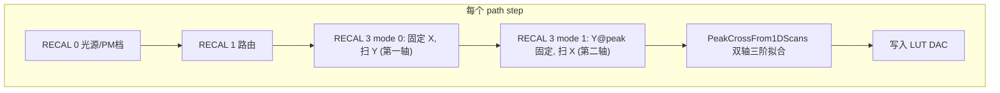
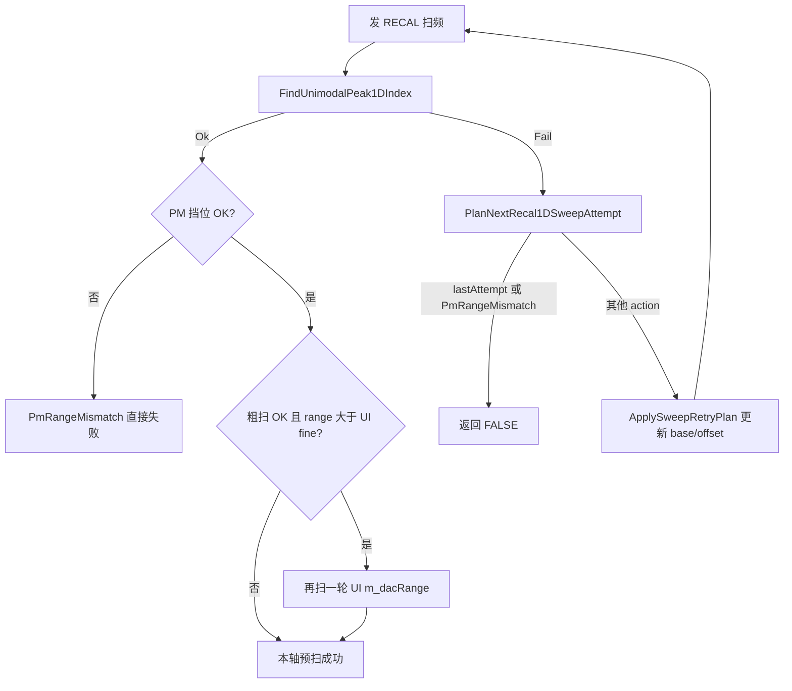
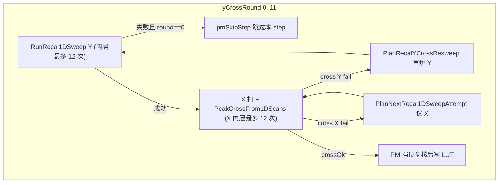

# M576 寻峰算法说明（PeakFinder）

本文档总结 M576 1310nm 校准工具中**两轴交叉寻峰**的完整设计与实现，是本程序业务核心。面向产线维护、固件对接与算法二次开发。

**相关文档**

| 文档 | 用途 |
|------|------|
| [`INVARIANTS.md`](INVARIANTS.md) | INV-10..19 寻峰/RECAL 不变量条文 |
| [`DEVELOPMENT_AND_CODE_GUIDE.md`](DEVELOPMENT_AND_CODE_GUIDE.md) | 模块与类索引 |
| [`算法优化TODO.md`](算法优化TODO.md) | 后续优化 backlog |
| [`PeakFinder找拐点算法讨论.png`](PeakFinder找拐点算法讨论.png) | 早期拐点讨论示意图 |

**设计原则**（与 `CLAUDE.md` / `m576-global.mdc` 一致）：固件扫频、定 base、判峰能力有限时，**上位机用可重试、可恢复、可追溯策略尽量让每一步校准成功**；明确区分「固件/通信硬失败」与「寻峰形状失败」。

---

## 1. 概述：两向 1D 扫频 + 软件交叉

PM/PD Run Path 的每一步**不是**在二维 DAC 网格上做真 2D 扫描，而是：

1. `RECAL 0` — 设置光源 / PM 挡位  
2. `RECAL 1` — 路由到当前 MEMS 通道  
3. **`RECAL 3` mode 0** — 固定 X（`baseX=9999`），扫 Y → **第一轴（Y 预扫）**  
4. **`RECAL 3` mode 1** — 固定 `baseY=Y@peak`，扫 X → **第二轴（X 扫）**  
5. **`PeakCrossFrom1DScans`** — 对两组功率序列分别做 1D 三阶拟合，得到交叉峰 `(row, col)` → DAC  
6. 写入 LUT 对应槽位  

（PD 路径使用 `RECAL 5`，语义与 `RECAL 3` 相同，见 INV-18。）



### 1.1 固件命令格式（INV-18）

6 个 ASCII 参数：

```text
RECAL 3 {mode} {baseX} {baseY} {offset} {step} {delay}
```

| mode | 含义 | baseX | baseY | 上位机动的轴 |
|------|------|-------|-------|-------------|
| **0** | 固定 X，扫 Y | `9999`（固件读当前 LUT） | `movingBase`（可平移） | Y |
| **1** | 固定 Y，扫 X | `movingBase`（可平移） | `Y@peak`（预扫结果） | X |

- `offset`：半窗 DAC 范围（UI 默认 `m_dacRange`，粗扫可扩至 200）  
- `step`：扫频步进（`m_dacStep`）  
- `delay`：每点稳定时间（`m_delayMs`）  

固件返回一行：`[col0] P1 P2 ... Pn`（功率 raw 值；无效点为 `-999999` 或 `-999900`，INV-14）。

---

## 2. 为何第一轴（Y 预扫）是关键

在 MEMS 二维峰面上，**Y 预扫决定光路是否对准峰脊**；X 扫是在 **Y 已锁定** 条件下的精修。第一轴失败会导致整步作废或系统性偏峰。

| 环节 | 第一轴 Y 失败的影响 |
|------|---------------------|
| Y 预扫 `RunRecal1DSweepWithPeakRecenterRetry` 失败（`yCrossRound==0`） | `pmSkipStep=TRUE`，**不发 RECAL 3 1**，本 step 跳过，path 继续下一步 |
| Y 预扫 Strict 已过，但交叉阶段 Y 再被拒 | `PlanRecalYCrossResweep` **重炉整段 Y**（最多 12 round），已扫的 X 数据作废 |
| Y cross OK，仅 X cross 失败 | **只重扫 X**（`PlanNextRecal1DSweepAttempt` on X），`fixedY` 不变，不重炉 Y |
| Y@peak 定错 | X 在错误 Y 上扫 → 交叉峰系统性偏移，LUT 写错 |

**结论**：产线排障应优先看 `RECAL 3 0` 的 attempt 序列、trend、baseY/offset 变化；X 问题往往在 Y 已稳定后才值得细查。

编排入口：`M576CalibratorDlg.cpp` 中 PM/PD 两条路径的 `yCrossRound` 外层循环 + `RunRecal1DSweepWithPeakRecenterRetry` 内层循环。

---

## 3. 代码分层（维护者地图）

| 层 | 文件 | 职责 |
|----|------|------|
| **1D 拟合/校验** | `PeakFinder2D.cpp` / `PeakFinder2D.h` | `ParabolaVertexMax1D`、`PeakCrossFrom1DScans`、`Peak1DValidateCode`、`Peak1DFitPolicy` |
| **扫频重规划** | `Peak1DSweepRecenter.cpp` / `Peak1DSweepRecenter.h` | `PlanNextRecal1DSweepAttempt`、`PlanRecalYCrossResweep`、`AnalyzeRecal1DSweepProfile`、recenter 启发式 |
| **常量** | `M576Peak1DConstants.h` | 门限、max attempts、coarse range；与 `CrossPeakTest` 共用 |
| **PM 挡位校验** | `PmRangeValidation.cpp` | `ValidatePeakPowerInPmRange`（仅 RECAL 3 PM 路径） |
| **业务编排** | `M576CalibratorDlg.cpp` | `RunRecal1DSweepWithPeakRecenterRetry`、cross 双循环、LUT 写入 |
| **离线验证** | `CrossPeakTest/main.cpp` | comm CSV 回放、planner 单测、门限回归 |

**分层约束**：bin 布局/CRC 在 `Z4671Core`；寻峰策略在 App 层，勿在 Dlg 里散落魔数（放 `M576Peak1DConstants.h`）。

---

## 4. 一维寻峰：`ParabolaVertexMax1D`

对单条扫频功率序列 `P1..Pn`，求连续峰位下标 `t*`（相对整条扫频格点），再换算 DAC。

### 4.1 处理流水线


1. **无效功率**：`-999999` / `-999900` 不参与 span/拟合（INV-14）。  
2. **突出度门限（Strict）**：预处理前全序列 `max−min >= MinProminenceDb`（默认 **0.3 dB**，经 `Peak1DDbToRawDelta` 换算 raw）；未达则 `ParabolaNotDownward`。运行时可由 exe 旁 `M576Calibrator.ini` 覆盖。  
3. **预处理**：孤立尖峰剔除 → `FindProminenceSymmetricWindow` 选拟合窗（肩点失败时用固定半窗/单调包络兜底）。  
4. **三阶拟合**：`P(i) ≈ a·i³ + b·i² + c·i + d`，在拟合窗闭区间上求极大得 `t*`。  
5. **Strict 附加拒收**（`Peak1DFitPolicy::Strict`）：  
   - 拟合窗内仍全序列单调 → `ParabolaNotDownward`  
   - 左平台假峰（`MIN_FIT_SPAN_FRAC`）  
   - 贴边且外侧导数仍上升/下降  
   - `t*` 超出 `[0, n−1]` → `VertexOutOfRange`  
   - `M576_PEAK1D_REJECT_EDGE_MAX=0` 时**允许**贴边峰（当前配置）  
   - 全扫频单调无峰 → `ParabolaNotDownward`  

### 4.2 两种拟合策略

| 策略 | 使用场景 | 相对 Strict 的放宽 |
|------|----------|-------------------|
| **`Strict`** | 首轮扫频、JumpFlatMax、MonoCoarseShift、FlatAtMaxShift、ShiftOnly | 全部门限生效 |
| **`FineRefineRelaxed`** | 粗扫 OK 后的 UI fine range 精扫；交叉阶段数据已在 fine range | 跳过 relFlat、全序列单调拒收、贴边导数拒收；三阶奇异/`VertexOutOfRange` 可 **argmax 回退** |

精扫判定：`IsFineRefineSweepAttempt(state)` 或 `Peak1DFitPolicyForSweepResult` / `Peak1DFitPolicyForCrossAxis`。

### 4.3 `Peak1DValidateCode` 含义

| 代码 | 含义 | 典型 recenter 方向 |
|------|------|-------------------|
| `Ok` | 寻峰成功 | — |
| `Empty` / `LowSpan` | 无数据或动态过小 | Flat 分支 / 扩 range |
| `ParabolaNotDownward` | 无峰形、单调、平台假峰等 | 依 trend：Flat→JumpFlatMax；StrictInc/Dec→MonoCoarseShift |
| `VertexOutOfRange` | `t*` 在窗外 | ShiftOnly / FlatAtMaxShift（贴边启发式） |
| `EdgeNotAllowed` | 顶点在扫频端（`REJECT_EDGE_MAX=1` 时） | 同 VOR |
| `NotEnoughValidSamples` | 预处理后样本不足 | Mono 粗扫 |
| `PmRangeMismatch` | PM 挡位功率越界（INV-16） | **不重试**，业务早退 |
| `ParabolaFitSingular` | 正规方程奇异 | Relaxed 可 argmax 回退 |

完整枚举见 `PeakFinder2D.h`。

### 4.4 扫频形状分类：`SweepTrend`

`AnalyzeRecal1DSweepProfile` 对有效功率序列分类，供 planner 选分支：

| trend | 判定直觉 | planner 倾向 |
|-------|----------|-------------|
| `Flat` | span 过小，无明显起伏 | JumpFlatMax → FlatAtMaxShift |
| `StrictInc` | 有效点严格单调升 | MonoCoarseShift（峰在右外） |
| `StrictDec` | 有效点严格单调降 | MonoCoarseShift（峰在左外） |
| `NonMono` | 有起伏非严格单调 | 贴边 argmax → ShiftOnly；内峰 → FineRefine |

---

## 5. 扫频重试：尽最大努力（INV-10 / INV-11 / INV-12）

固件每次只返回**当前窗口**内的一条曲线。窗口不对时，上位机通过 **改 `offset`（扩半窗）** 与 **改 `base`（平移中心）** 重新发 RECAL，直到寻峰 Ok 或打满次数。

### 5.1 内层循环（单轴一次「预扫任务」）

`RunRecal1DSweepWithPeakRecenterRetry`：最多 **`M576_PEAK1D_SWEEP_RECENTER_MAX_ATTEMPTS`（12）** 次硬件扫频。



**早退条件（当前实现）**

- `attempt` 已达最后一次（`lastAttempt`）  
- `PmRangeMismatch`（INV-16，PM 路径）  
- 通信失败 / 无响应行 / 解析失败（Dlg 层，非 planner GiveUp）  

**INV-12 fallback（2026-07）**：在未满 12 次时，专用分支均未命中则走 `SuggestFallbackSweepRetryPlan` 三阶阶梯（JumpFlatMax → FineRefine → FlatAtMaxShift），**禁止过早 GiveUp**。历史版本曾在部分 `VertexOutOfRange + Flat` 组合上第 3 次即 GiveUp；现网应打满或业务早退。

### 5.2 Planner 专用分支（INV-10 / INV-11）

`PlanNextRecal1DSweepAttempt` 根据 **validate_code + trend + session 状态** 选择下一刀：

| 条件 | action | 行为摘要 |
|------|--------|----------|
| Flat + PND/VOR/Edge 等（`IsFlatSweepFailure`），尚未 jump-max | `JumpFlatMax` | offset **一步跳到 200**（非 ×2 阶梯），base 不变 |
| JumpFlatMax@200 后内峰 + 左肩充分（`IsCoarseExpandedInteriorPeak`） | `FineRefine` | base 由粗 hint 定心，offset 回 UI fine |
| Flat@max 仍失败 | `FlatAtMaxShift` | 保持 offset=200，平移 baseY/baseX；内峰用 `PeakBaseFromCoarseHint` |
| Flat@max 连续反向平移（ping-pong） | `FineRefine` | `DetectSweepRecenterOscillation` 强制精扫 |
| StrictInc/Dec + PND（`IsMonotoneSweepFailure`） | `MonoCoarseShift` | offset=200 **且同步** `SuggestSweepRecenterNewBase` |
| 粗扫阶段后续 mono 失败 | `ShiftOnly` | 保持 coarse range，继续平移 base |
| 粗扫 OK / coarse hint（`IsCoarsePeakHint`） | `FineRefine` | offset 回 UI `m_dacRange`，Relaxed 拟合 |
| VOR/Edge 贴边等（`IsRetryablePeakFailure`） | `ShiftOnly` | t* 与 argmax 混合启发式平移 |
| 均未命中 | **fallback 三阶梯** | JumpFlatMax → FineRefine → FlatAtMaxShift |

**粗扫 + 精扫两轨**：粗扫用 `Strict` 定位；成功后若 `NeedsFineRefineAfterSuccess`（粗 range > UI fine），自动再扫一轮 **FineRefine**（`PlanFineRefineAfterCoarseSuccess`）。

**DAC 换算**：峰位连续下标 `t*` → `RecalDacAtPeakIndexFromSweepCol0(col0, t*, range)`；`newBase` 钳位 int16 全范围，**禁止**负值抹零（INV-13）。

### 5.3 Session 状态：`SweepRecenterSessionState`

| 字段 | 含义 |
|------|------|
| `uiFineRange` | UI 设定的 fine offset（通常 64） |
| `movingBase` | 当前可平移的 base DAC |
| `attemptRange` | 当前 offset |
| `flatJumpedToMax` | 是否已扩到 max range |
| `inCoarsePhase` | 是否处于粗扫阶段 |
| `fineConsumed` | 是否已做过 FineRefine |
| `flatShiftCount` / `oscillationDetected` | Flat@max 平移计数与震荡检测 |

---

## 6. 两轴交叉寻峰：`PeakCrossFrom1DScans`

Y 预扫与 X 扫各得到一条等长功率序列后，**分别**调用 `ParabolaVertexMax1D`；**两轴都 Ok** 才返回成功。

```text
crossOk = PeakCrossFrom1DScans(powY, powX, row, col, &yCross, &xCross, &tY, &tX, ...)
```

- `row` / `col` = `lround(tY)` / `lround(tX)`  
- Policy：  
  - **Y**：`Peak1DFitPolicyForSweepResult(ySweepRange, m_dacRange)` — 若 Y 已在 fine range 则用 Relaxed  
  - **X**：`Peak1DFitPolicyForCrossAxis(xRetryState, attemptDacRange, uiFineRange)`  

交叉失败时 `yCross` / `xCross` 分别记录各轴 validate_code（INV-15），日志用 `M576FormatPeak1DMsg` 输出。

**注意**：交叉阶段用的是**同一组**已采集的 powY/powX 做软件再拟合；与预扫阶段的 Strict 判定可能不同（例如预扫 Strict 已过，交叉用 Relaxed 仍可能拒 Y）。

---

## 7. 外层重试：Y 预扫 vs Y cross 两级结构

每个 path step 有一个 **`yCrossRound` 外层循环**（0..11），内嵌 Y 预扫内层（12 次）与 X 扫 + cross 内层（12 次）。



### 7.1 INV-19：Y 预扫过、交叉 Y 不过 → 重炉 Y

`PlanRecalYCrossResweep` 内部复用 **同一** `PlanNextRecal1DSweepAttempt`，根据交叉失败码与已有 powY 规划下一轮 `baseY`/`offset`，然后 **重新执行整段** `RunRecal1DSweepWithPeakRecenterRetry`（不是简单重复上一刀参数）。

日志：`cross retry: re-sweep RECAL 3 0 round N/M`。

### 7.2 X cross 失败：只动 X

`fixedY`（Y@peak）保持不变，对 X 走 `PlanNextRecal1DSweepAttempt` → 再发 `RECAL 3 1`。  
**不重炉 Y**（除非 Y cross 失败触发 INV-19）。

### 7.3 X 粗扫 cross OK 后的 fine refine

若 X 仍在粗 range（200）且 cross 已成功，Dlg 可能再发一轮 X **FineRefine**（`PlanFineRefineAfterCoarseSuccess`），用 Relaxed 精扫后更新 DAC。

### 7.4 重试量级（产线预期）

| 层级 | 上限 | 说明 |
|------|------|------|
| Y 预扫内层 | 12 attempts/round | 每次 attempt 一次固件扫频 |
| Y cross 重炉 | 12 rounds | 每 round 重新跑完整 Y 预扫内层 |
| X 扫内层 | 12 attempts/round | 固定 Y@peak |
| 理论单步 Y 扫频次数 | 最多 12×12 = 144 | 极端情况；正常几步到十几步 |

---

## 8. 上位机尽力 vs 固件/硬件边界

### 8.1 上位机已做的「尽最大努力」

- 扩 offset（如 64→200）、平移 base、粗扫+精扫两轨  
- 专用分支 + INV-12 fallback，避免过早放弃  
- Y/X 共用 planner；交叉 Y 失败重炉；X 失败只扫 X  
- PM 挡位校验（INV-16）；Run Path 后 `opm` 挡位核对（INV-17）  
- 结构化日志：validate_code、trend、attempt、base、offset、col0  
- comm CSV 落盘，供 `CrossPeakTest` 回放回归  

### 8.2 固件/硬件仍须保证

- `RECAL 3/5` 按 6 参数扫频并返回完整 `P1..Pn`  
- 无效占位与协议一致；`delay` 内 MEMS 稳定  
- 透传 `trans`/`$$` 可靠，有超时（INV-31/32）  
- 返回点数与 host `dacStep`/`offset` 一致（不一致时 UI 仅 warning）  

### 8.3 软件无法补救的情况

- Flash/LUT 初值远离真峰且窗口内完全无峰形  
- 光路断、IL 极差、通道映射错误  
- 固件返回全 invalid 或通信持续失败  
- PM 挡位设置与实功率严重不匹配（`PmRangeMismatch`）  

此时应查硬件/路由/初值，而非无限放宽门限。

---

## 9. 可追溯性与验证

### 9.1 UI 日志关键词

| 标签 | 含义 |
|------|------|
| `flat jump:` | JumpFlatMax，扩 offset |
| `mono coarse:` | MonoCoarseShift，粗扫+平移 base |
| `flat shift:` | FlatAtMaxShift |
| `fine refine:` | 精扫回 UI range |
| `peak retry:` / `peak retry summary:` | 预扫结束汇总 attempts |
| `cross retry:` | INV-19 Y 重炉 |

### 9.2 comm CSV

Run Path 实时写入 `comm_*_recal_sweeps.csv`（路径、attempt、validate_code、功率序列等），与 UI 日志对表。

### 9.3 回归要求

改 planner / 门限 / 拟合逻辑后：

```text
msbuild M576Calibrator\CrossPeakTest\CrossPeakTest.vcxproj /p:Configuration=Release /p:Platform=Win32
M576Calibrator\CrossPeakTest\Release\CrossPeakTest.exe
```

须同步 `M576Peak1DConstants.h` 与 `CrossPeakTest/main.cpp` 中的 fixture/期望。

---

## 10. 关键常量速查

来源：`M576Peak1DConstants.h`（及 `CalibConstants.h` 中的 `M576_MAX_DAC_RANGE`）。

| 宏 | 默认值 | 含义 |
|----|--------|------|
| `M576_PEAK1D_SWEEP_RECENTER_MAX_ATTEMPTS` | 12 | 单轴预扫 / cross round 上限 |
| `M576_MAX_DAC_RANGE` | 200 | 粗扫最大半窗 offset |
| `M576_PEAK1D_COARSE_DAC_RANGE` | 200 | 粗扫标准 offset |
| `M576_PEAK1D_MIN_PROMINENCE_DB` | 0.3 | Strict 全序列突出度下限 (dB) |
| `M576_PEAK1D_MIN_SPAN_DB` | 2.5 | Flat 判定 / recenter span 参考 |
| `M576_PEAK1D_COARSE_MIN_SPAN_DB` | 0.5 | JumpFlatMax 后认粗峰 span 下限 |
| `M576_PEAK1D_CUBIC_MIN_SAMPLES` | 4 | 三阶拟合最少样本 |
| `M576_PEAK1D_REJECT_EDGE_MAX` | 0 | 0=允许贴边峰；1=拒绝贴边 |
| `M576_RECAL_FW_READ_BASE_DAC` | 9999 | 固件读当前 LUT 的占位 base |
| `M576_PEAK1D_FLAT_OSC_MIN_DAC` | 40 | Flat ping-pong 检测最小 base 步长 |

`MinProminenceDb` 可由 `M576Calibrator.ini` 在 `[Peak1D]` 节配置（重启生效）。

---

## 11. 典型场景读日志

### 11.1 「只试了 3 次就失败」

可能原因：

1. **历史行为**：旧版 planner 在 `VertexOutOfRange + Flat` 等组合上过早 `GiveUp`（INV-12 fallback 已修复，应继续至 12 次或 `PmRangeMismatch`）。  
2. **`PmRangeMismatch`**：PM 挡位与峰值功率不匹配，不重试。  
3. **通信失败**：`no line`、串口写失败 — 归类为 Comm，非寻峰门限。  
4. **`yCrossRound==0` 预扫失败**：直接 `pmSkipStep`，不会进入 cross 重炉。

### 11.2 单调递增/贴边仍判 Ok

多发生在 **FineRefineRelaxed** 精扫：跳过全序列单调拒收，三阶失败时 **argmax 回退**。峰可能仍在窗外；产线应结合 IL 复测与 Y-span 判断可接受性。

### 11.3 Y 预扫 Ok，交叉 Y 失败

走 **INV-19**：日志出现 `cross retry: re-sweep RECAL 3 0 round N`；用 `PlanRecalYCrossResweep` 规划的新 baseY/offset 重扫，而非重复上一轮参数。

### 11.4 同一 step 在 comm CSV 出现两段 Y 扫

可能是 path **跑了两遍**（整 path 重跑），或第一轮 Y 失败后后续 round 成功。看 `step`/`attempt` 与前后 step 序号区分，勿误读为「同一次只给 3 次机会」。

---

## 12. 函数索引（快速定位）

| 函数 | 文件 | 作用 |
|------|------|------|
| `ParabolaVertexMax1D` | PeakFinder2D.cpp | 1D 三阶拟合核心 |
| `PeakCrossFrom1DScans` | PeakFinder2D.cpp | 双轴交叉判定 |
| `AnalyzeRecal1DSweepProfile` | Peak1DSweepRecenter.cpp | trend/span/argmax |
| `PlanNextRecal1DSweepAttempt` | Peak1DSweepRecenter.cpp | 下一刀扫频规划 |
| `SuggestFallbackSweepRetryPlan` | Peak1DSweepRecenter.cpp | INV-12 兜底三阶梯 |
| `PlanRecalYCrossResweep` | Peak1DSweepRecenter.cpp | INV-19 Y 重炉规划 |
| `RunRecal1DSweepWithPeakRecenterRetry` | M576CalibratorDlg.cpp | 单轴预扫+内层重试 |
| `ValidatePeakPowerInPmRange` | PmRangeValidation.cpp | PM 挡位校验 |

---

*文档版本：与仓库 INV-10..19、INV-12 fallback（2026-07）对齐。算法变更时请同步更新本文与 `INVARIANTS.md`。*
