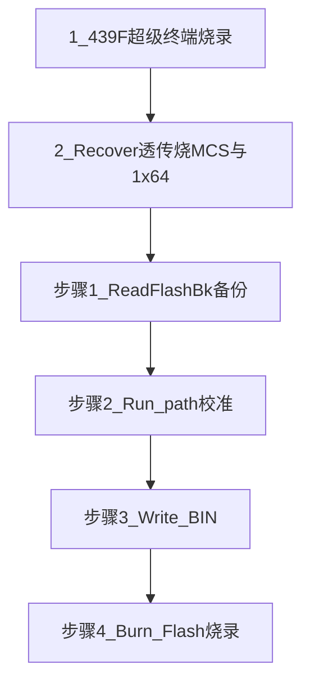

# M576 / 1310 定标工具 产线用户手册

**软件名称**：M576 / 1310 Calibrator（439F）  
**文档对象**：产线操作员（无需了解通信协议或固件细节）  
**文档目的**：按固定顺序完成「备份 → 校准 → 写 BIN → 烧录」，并在上架前完成附录中的固件准备。

---

## 1. 手册里会出现的界面原文

本软件界面以英文按钮为主。下文首次出现时用 **中文说明（界面英文）** 对照，请对照屏幕逐字点击。

| 中文说明 | 界面上的英文 |
|----------|----------------|
| 打开串口 | Open Port |
| 关闭串口 | Close |
| 连接测试 | Test connection |
| 读序列号 | Read SN |
| 读 Flash 备份 | ReadFlashBk |
| 烧录恢复（按文件烧录） | Recover |
| 跑定标路径 | Run path (RECAL) |
| 写 BIN | Write BIN |
| 生成 BIN（产线一般不用） | Make Bin |
| 烧录 Flash | Burn Flash |
| 停止 | Stop |
| 导出统计 | Export stats (CSV) |

---

## 2. 安全与操作纪律

1. **烧录会改写设备内程序或定标数据，不可随意撤销。** 仅在工艺允许、设备已停线或处于指定工位时操作。  
2. **一台电脑、一根线、一台设备**，避免串口被其他软件占用。  
3. 出现不明白的英文报错或反复失败时，**停止操作**，保留界面与日志，联系工艺或工程人员。  
4. **同一时刻只能跑一项后台任务**（例如正在 ReadFlashBk 时不要点 Burn Flash）。若按钮无反应或日志提示 “wait…”，请先等上一项结束。

---

## 3. 总流程一览（上架前准备 + 主流程）

上架前请先做 **附录 A**；日常定标主流程为 **四步**，顺序不要打乱。

---

## 上架前固件准备（附件）

在正式跑「备份 → 校准 → 写 BIN → 烧录」之前，按工艺要求完成以下两项。**具体文件名、是否使用 XMODEM、如何进入下载模式** 以 **产线工艺卡** 为准，本手册只给操作顺序骨架。

### 1 439F：使用超级终端烧录

**目的**：保证 439F 控制板上运行的是工艺规定的固件版本。

**操作骨架**（细节以工艺卡为准）：

1. 用超级终端（或工艺指定的等价串口工具）打开与 439F 相连的 **COM 口**。  
2. 设置波特率等为 **工艺规定值**（常见为 115200 8N1，与工艺卡核对）。  
3. 按工艺卡使 439F 进入 **可接收固件** 的状态（上电顺序、按键、短接等以工艺卡为准）。  
4. 按工艺卡选择 **发送文件 / 接收文件 / 协议类型**（如 XMODEM、YMODEM 等），选择工艺下发的 **439F 镜像文件**，开始传输直至成功结束。  
5. 断电重启或按工艺卡复位，确认设备能正常启动。

**说明**：若当前 Windows 没有「超级终端」，由工艺或工程指定 **PuTTY、SecureCRT** 等替代工具；步骤仍是「打开串口 → 按工艺进下载模式 → 按协议传文件」。

**可选自检**：烧录完成后可打开本软件，选对口后点 **Test connection**，若工艺允许用 `info` 类指令验证，工程会告知你如何解读成功信息。

---

### 2 MCS 与 1×64：使用本软件 **Recover** 透传烧录

**目的**：在单根 439F 串口上，通过透传把 **磁盘上已有的 BIN** 烧进 MCS（两路）和 1×64（两路各四开关）。产线口语里常说的「recover bin」对应本按钮 **Recover**。

**与 Burn Flash 的区别（重要）**：

| 按钮 | 烧的是什么文件 |
|------|----------------|
| **Recover** | 你在弹窗里 **逐行勾选** 的磁盘路径（常用于 **恢复备份** 或 **工艺预置 bin**）。默认路径会按 `output\backup.bin` 的基名自动填，也可点 `...` 浏览改路径。 |
| **Burn Flash** | 以 **`output\standard.bin` 为基名** 生成的那一套定标输出文件（主流程第 3 步 **Write BIN** 之后使用）。 |

**操作步骤**：

1. 连接 USB 转串口到 439F，打开本软件。  
2. 在 **Port** 下拉框选择正确 COM 口，点 **Open Port**。  
3. 确认没有其它长任务在跑（若刚跑完校准或备份，等进度条与日志安静下来）。  
4. 在 **Backup** 区域找到 **Recover** 按钮，点击。  
5. 弹出窗口标题为 **Recover Flash: select per-file .bin**。  
   - 每一行前有勾选框：**MCS1 (trans1)**、**MCS2 (trans2)**、**1x64#1 sw1～sw4**、**1x64#2 sw1～sw4**。  
   - 只勾选 **本次需要烧录** 的行；路径一般为 `...\output\backup_mcs1.bin` 等，若工艺要求换文件，点该行右侧 **`...`** 选择工艺下发的 bin。  
6. 点 **OK**。  
7. 阅读警告框，确认无误后选 **Yes** 继续。  
8. 等待进度条走完，查看下方 **Log** 窗口是否出现成功说明；失败时不要重复盲烧，联系工程并准备好 `output` 下按日期命名的通信日志（见第 8 节 FAQ）。

**默认会涉及的文件名（基名为 `backup.bin` 时，均在 `output` 文件夹）**：

- `backup_mcs1.bin`、`backup_mcs2.bin`  
- `backup_1x64_1_sw1.bin` … `backup_1x64_1_sw4.bin`  
- `backup_1x64_2_sw1.bin` … `backup_1x64_2_sw4.bin`  

若工艺使用旧命名 `backup_t1.bin` … `backup_t4.bin`，软件在读取时也会尝试兼容，但以工程确认为准。

---

## 4. 主流程：四步定标（顺序固定）

以下假设 **附录 A** 已完成。界面分区名称：**Connection**（串口）、**Backup**、**Paths / calibration**、**Actions**（一排按钮）、**Log**（日志）。

### 步骤 1：备份（ReadFlashBk）

**你要做的事**：把设备里现有的定标相关数据读到电脑，生成备份 bin，供后面「写 BIN」时合并。

1. **Port** 选对 COM，点 **Open Port**（失败则换 USB 口或检查线，仍失败找工程）。  
2. （**强烈建议**）在 **Read SN (trans1-4)** 区域点 **Read SN**，等完成后把读到的序列号 **抄到或保留在工艺记录**；写 BIN 时头信息会用到界面上的 SN 栏（以工程说明为准）。  
3. **Backup BIN** 一栏程序已固定为相对路径 **`output\backup.bin`**（一般不要去改）。  
4. 点 **ReadFlashBk**。  
5. 等待进度条结束，日志无红色报错类提示。成功后在 **`程序目录\output\`** 下应能看到与上一节所列类似的 **`backup_*.bin`** 多个文件。

**注意**：若正在进行 **Burn Flash** 或其它后台任务，软件会提示先等待；请等结束后再点 **ReadFlashBk**。

---

### 步骤 2：校准（Run path (RECAL)）

**你要做的事**：按工艺选 PM 或 PD 模式，让设备自动跑完整定标路径（时间较长，请勿拔线、勿关软件）。

1. 在 **Paths / calibration** 区域选择 **Mode**：  
   - **PM (RECAL 1)**：外接功率计方案（工艺常用）。  
   - **PD (RECAL 2)**：使用板载 PD 方案（是否启用由工艺规定）。  
2. 按工艺卡设置 **RECAL0 TLS**、**nm（波长）**、**PM** 等下拉框（不懂就按工艺给的截图或表格选，不要随意改）。  
3. **delay ms / DAC range / DAC step** 一般由工程预设；产线无指示时不要改。  
4. 确认 **Path CSV** 说明里指向的是软件自带的 `output\pm_*.csv` 或 `output\pd_*.csv`（程序会自动用默认路径，**不要改 CSV 文件名** 除非工程书面要求）。  
5. 点 **Run path (RECAL)**。  
6. 等待进度条缓慢前进直至结束。期间若工艺允许中断，可点 **Stop**；点完后仍需等待当前步骤安全结束，不要立刻关电或拔线。  
7. 若工艺需要留档，可在结束后点 **Export stats (CSV)**，把统计表交给工程（可选）。

---

### 步骤 3：写 BIN（Write BIN）

**你要做的事**：把本次校准结果与备份 bin 按规则合并，在电脑上生成 **待烧录** 的一套标准 bin（基名为 `standard.bin`）。

1. **Output BIN base** 已固定为 **`output\standard.bin`**，一般无需修改。  
2. 点 **Write BIN**。  
3. 若弹出警告说会话里没有定标数据，通常表示 **步骤 2 未成功** 或未读到备份；不要强行继续，联系工程。  
4. 成功后会弹出完成提示，日志中有成功说明。  
5. 在 **`程序目录\output\`** 下会生成或覆盖以 **`standard`** 为基名的分文件，例如：  
   - `standard_mcs1.bin`、`standard_mcs2.bin`  
   - `standard_1x64_1_sw1.bin` … `standard_1x64_2_sw4.bin`  
   同时会导出 **`standardAll1310DAC.csv`**（工程分析用，产线可只确认文件存在）。

---

### 步骤 4：烧录（Burn Flash）

**你要做的事**：把上一步写好的 **`standard_*.bin`** 经 439F 透传烧进对应器件。

1. 确认 **步骤 3** 已成功，`output` 下已有非空的 **`standard_*.bin`**。  
2. 点 **Burn Flash**。  
3. 仔细阅读警告框：大意是 **Trans 1～2 烧 MCS 固件流，Trans 3～4 对 1×64 使用 XMODEM 分四路烧录**。只有工艺允许继续时点 **Yes**。  
4. 在 **Burn: select per-trans .bin** 窗口中，勾选本次要烧录的文件（可部分勾选，是否允许部分烧录由工艺规定）。  
5. 点 **OK**，等待后台烧录完成，观察进度条与日志。  
6. 完成后按工艺进行复位、复测或贴标。

---

## 5. 其它按钮说明（避免误操作）

### 5.1 Test connection（连接测试）

用于检查 439F 文本通路是否正常（例如工程让你点一下确认线序与版本）。**不能替代**定标四步。

### 5.2 Make Bin（产线标准流程不要用）

**Make Bin** 会读取 `output\standardAll1310DAC.csv` 里的数据再生成 bin，用于工程 **离线改表后重生成** 的场景。**产线常规定标不要用**，除非你手上有工程签字允许的 CSV 版本。

---

## 6. 常见问题（FAQ）

**Q1：点 Open Port 失败。**  
检查 USB 驱动、COM 号是否被其他软件占用、线是否只连 439F。仍失败找工程。

**Q2：很多按钮点了没反应。**  
多半有后台任务未结束（读备份、跑路径、烧录等）。看日志里是否有 “wait…” 类提示，等进度条停稳后再试。

**Q3：Burn Flash 提示没有 bin。**  
先完成 **Write BIN**，或确认 `output` 下已有工艺提供的 `standard_*.bin`。

**Q4：Recover 和 Burn Flash 我该点哪个？**  
- 上架前按工艺 **恢复指定文件** → **Recover**。  
- 本台机器刚跑完定标要写回 **standard 那一套** → **Burn Flash**。

**Q5：通信日志在哪里，报障要拷什么？**  
在 **`程序目录\output\`** 下查找按日期命名的文件：**`comm_YYYY-MM-DD.log`**（例如 `comm_2026-05-11.log`）。把失败时刻前后一段发给工程即可。

---

