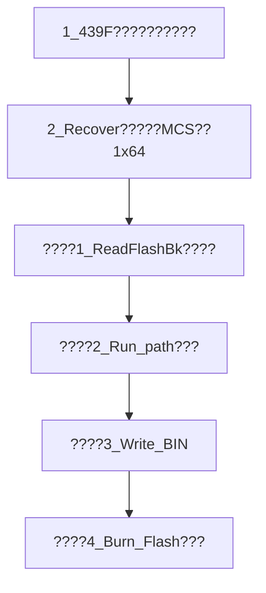

# M576 / 1310 ?????? ??????????

**????????**??M576 / 1310 Calibrator??439F??  
**???????**?????????????????????????????????  
**??????**??????????????????? ?? ??? ?? ?? BIN ?? ???????????????????????????????

---

## 1. ????????????????

???????????????????????????????????? **?????????????????** ?????????????????????

| ??????? | ?????????? |
|----------|----------------|
| ????? | Open Port |
| ?????? | Close |
| ??????? | Test connection |
| ???????? | Read SN |
| ?? Flash ???? | ReadFlashBk |
| ?????????????????? | Recover |
| ????????? | Run path (RECAL) |
| ?? BIN | Write BIN |
| ???? BIN???????????? | Make Bin |
| ??? Flash | Burn Flash |
| ?? | Stop |
| ??????? | Export stats (CSV) |

---

## 2. ????????????

1. **???????????????????????????????????** ??????????????????????????????????????  
2. **??????????????????**??????????????????????  
3. ?????????????????????????**??????**???????????????????????????????  
4. **???????????????????**?????????? ReadFlashBk ?????? Burn Flash????????????????????? ??wait?????????????????????

---

## 3. ?????????????????? + ???????

?????????? **??? A**???????????????? **???**???????????

```mermaid
flowchart TD
  prep439f[1_439F??????????]
  prepMcs[2_Recover?????MCS??1x64]
  backup[????1_ReadFlashBk????]
  calib[????2_Run_path???]
  writeBin[????3_Write_BIN]
  burn[????4_Burn_Flash???]
  prep439f --> prepMcs
  prepMcs --> backup
  backup --> calib
  calib --> writeBin
  writeBin --> burn
```

---

## ??????????????????

???????????? ?? ??? ?? ?? BIN ?? ?????????????????????????????**????????????????? XMODEM???????????????** ?? **????????** ??????????????????????

### 1 439F???????????????

**???**????? 439F ?????????????????????????????

**???????**?????????????????

1. ???????????????????????????????? 439F ?????? **COM ??**??  
2. ???????????? **???????**??????? 115200 8N1?????????????  
3. ???????? 439F ???? **???????** ?????????????????????????????????  
4. ?????????? **??????? / ??????? / ????????**???? XMODEM??YMODEM ???????????????? **439F ???????**?????????????????????  
5. ?????????????????????????????????????

**???**??????? Windows ????????????????????????? **PuTTY??SecureCRT** ???????????????????????? ?? ????????????? ?? ??????????????

**??????**???????????????????????? **Test connection**?????????????? `info` ?????????????????????????????????

---

### 2 MCS ?? 1??64?????????? **Recover** ??????

**???**??????? 439F ??????????????? **???????????? BIN** ??? MCS?????????? 1??64?????????????????????????????recover bin?????????? **Recover**??

**?? Burn Flash ???????????**??

| ??? | ?????????? |
|------|----------------|
| **Recover** | ????????? **???????** ????????????????? **???????** ?? **??????? bin**???????????? `{SN}_backup.bin`?????? **Read All SN**???????? `...` ??????????? |
| **Burn Flash** | ?? **`output\latest\` ?? `{SN}_standard.bin`** ?????????????? 3 ?? **Write BIN** ????????? |

**????????**??

1. ???? USB ?????? 439F???????????  
2. ?? **Port** ???????????? COM ????? **Open Port**??  
3. ????????????????????????????????????????????????????????????  
4. ?? **Backup** ??????? **Recover** ??????????  
5. ???????????? **Recover Flash: select per-file .bin**??  
   - ????????????**MCS1 (trans1)**??**MCS2 (trans2)**??**1x64#1 sw1??sw4**??**1x64#2 sw1??sw4**??  
   - ???? **??????????** ?????????????? `...\output\{SN}_backup.bin` ????????????????????????? **`...`** ??????????? bin??  
6. ?? **OK**??  
7. ????????????????? **Yes** ??????  
8. ??????????????????? **Log** ???????????????????????????????????????????? `output` ?????????????????????????? 8 ?? FAQ????

**??????p?????????????? `backup.bin` ??????? `output` ???????**??

- `backup_mcs1.bin`??`backup_mcs2.bin`  
- `backup_1x64_1_sw1.bin` ?? `backup_1x64_1_sw4.bin`  
- `backup_1x64_2_sw1.bin` ?? `backup_1x64_2_sw4.bin`  

?????????????? `backup_t1.bin` ?? `backup_t4.bin`??????????????????????????????????

**历史追溯（archive）**：Read All SN 成功创建 `output\archive\{时间_MCS1SN}\`；Read Flash / Write BIN / Burn 前分别快照到 `backup\`、`standard\`、`pre_burn\`。日常操作只用 `output\latest\`。

---

## 4. ?????????????????????

??????? **??? A** ???????????????????**Connection**?????????**Backup**??**Paths / calibration**??**Actions**???????????**Log**?????????

### ???? 1???????ReadFlashBk??

**?????????**???????????????????????????????????????? bin????????N?? BIN????????

1. **Port** ??? COM???? **Open Port**??????? USB ?????????????????????  
2. ??**??????**???? **Read SN (trans1-4)** ????? **Read SN**???????????????????? **???????????????**???? BIN ????????????????? SN ??????????????????  
3. **Backup BIN** ???????????? **`output\latest\`**????????????  
4. ?? **ReadFlashBk**??  
5. ???????????????????????????????????????? **`??????\output\`** ???????????????????????? **`backup_*.bin`** ????????

**???**??????????? **Burn Flash** ??????????????????????????????????????? **ReadFlashBk**??

---

### ???? 2???????Run path (RECAL)??

**?????????**????????? PM ?? PD ??????????????????????????????????????????????????????

1. ?? **Paths / calibration** ??????? **Mode**??  
   - **PM (RECAL 1)**????????????????????????  
   - **PD (RECAL 2)**???????? PD ????????????????????????  
2. ??????????? **RECAL0 TLS**??**nm????????**??**PM** ??????????????????????????????????????????  
3. **delay ms / DAC range / DAC step** ???????????t???????????????  
4. ??? **Path CSV** ???????????????????? `output\pm_*.csv` ?? `output\pd_*.csv`?????????????????????**????? CSV ?????** ???????????????  

   **Run Path ????**??????????????? **Read All SN**????????? ReadFlashBk?????????????????? Flash????????????????? SN ???????? Run Path????????? Read Flash ?? `output\{SN}_backup.bin` ??????????????? Run Path??????????? Flash??

5. ?? **Run path (RECAL)**??  
6. ?????????????????????????????????????????????? **Stop**??????????????????????????????????????????  
7. ????????????????????????? **Export stats (CSV)**????????????????????????

---

### ???? 3???? BIN??Write BIN??

**?????????**????????????????? bin ????????????????????? **?????** ??????? bin??????? `standard.bin`????

1. **Output BIN** ??????? **`output\latest\`**?????????????  
2. ?? **Write BIN**??  
3. ????????????????????????????????? **???? 2 ?????** ?????????????????????????????????  
4. ???????????????????????????????  
5. ?? **`??????\output\`** ??????????? **`standard`** ??????????????????  
   - `standard_mcs1.bin`??`standard_mcs2.bin`  
   - `standard_1x64_1_sw1.bin` ?? `standard_1x64_2_sw4.bin`  
   ?????? **`standardAll1310DAC.csv`**???????????????????????????????

---

### ???? 4???????Burn Flash??

**?????????**?????????????? **`{SN}_standard.bin`** ?? 439F ???????????????

1. ??? **???? 3** ??????`output` ?????????? **`{SN}_standard.bin`**??  
2. ?? **Burn Flash**??  
3. ???????????????? **Trans 1??2 ?? MCS ???????Trans 3??4 ?? 1??64 ??? XMODEM ?????????**???????????????????? **Yes**??  
4. ?? **Burn: select per-trans .bin** ????????????????????????????????????????????????????????????  
5. ?? **OK**??????????????????????????????  
6. ?????????????????????????

---

## 5. ???????????????????????

### 5.1 Test connection??????????

?????? 439F ???????????????????F?????????????????????????**???????**?????????

### 5.2 Make Bin?????????????????

**Make Bin** ???? `{MCS1_SN}_standardAll1310DAC.csv` ????????????? bin????????? **??????????????** ???????**?????????????**??????????????????????????? CSV ?????

---

## 6. ????????FAQ??

**Q1???? Open Port ????**  
??? USB ??????COM ?????????????????????????? 439F?????????????

**Q2????????????????**  
??????????????????????????????????????????????????????? ??wait???? ???????????????????????

**Q3??Burn Flash ?????? bin??**  
????? **Write BIN**??????? `output` ?????????????? `{SN}_standard.bin`??

**Q4??Recover ?? Burn Flash ?????????**  
- ?????????? **?????????** ?? **Recover**??  
- ???????????????????? **standard ?????** ?? **Burn Flash**??

**Q5?????????????????????????**  
?? **`??????\output\`** ?????????????????????**`comm_YYYY-MM-DD.log`**?????? `comm_2026-05-11.log`???????????????????????????????

---

