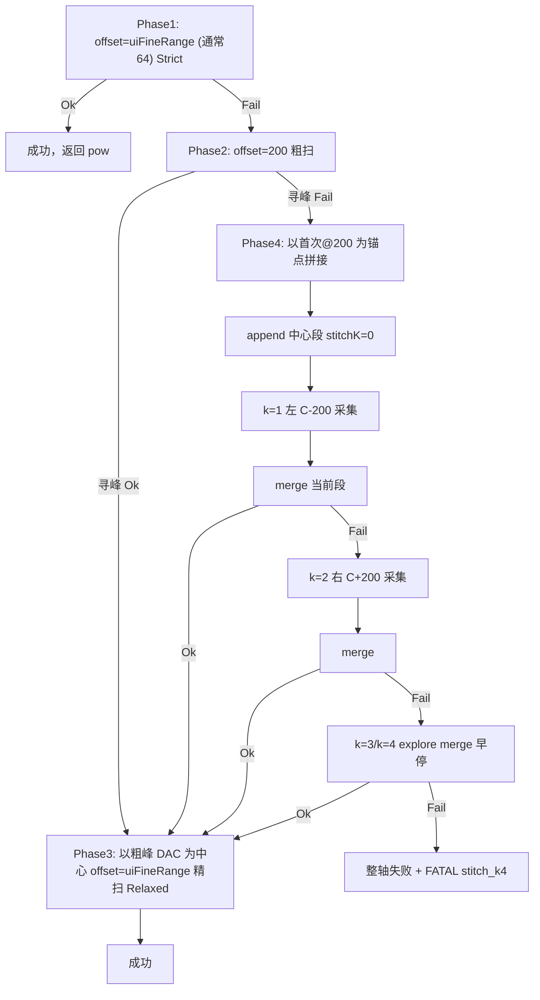

# 拼接式扫频重试策略改造计划

## 目标行为（已确认参数）

用户指定的新策略（相对当前 `PlanNextRecal1DSweepAttempt` 启发式链）：



**整轴失败（FATAL）**：在新 pipeline 下应极少发生；一旦发生必须**可检索、可定位**（见下文 §7）。

| 参数 | 值 |
|------|-----|
| 初始半窗 | `uiFineRange` = UI `m_dacRange`（通常 64） |
| 粗扫半窗 | `M576_MAX_DAC_RANGE` = 200 |
| 精扫半窗 | `uiFineRange` = UI `m_dacRange`（通常 64，与 Phase1 相同） |
| 拼接位移步进 | **对称 ±200**：k=1 左 −200、k=2 右 +200；扩展 k=3/k=4 为 ±400 |
| 拼接方向 | k=1 左、k=2 右（对称采集）；k=3/k=4 扩展摸索 |
| 拼接次数上限 | **对称 2 次 + 扩展 2 次**（不含中心段）；**每次 append 后 merge，Ok 即停** |
| 合成寻峰 | 平台峰（k=0,1,2 齐全）→ 双拐点；非平台/两段/扩展 → FineRefineRelaxed |
| 业务早退 | `PmRangeMismatch` 仍立即失败（INV-16） |

**拼接位移表**（`anchorBase` = 首次@200 **扫频中心** `floor(col0 + halfRange)`）：

| 拼接次序 k | 方向 | `movingBase` | 相对锚点 | merge 时机 |
|-----------|------|--------------|----------|------------|
| 0 | 中心 | 首次@200 | 0 | 不单独 merge |
| 1 | 左 | `C - 200` | −200 | append 后 merge，Ok 则停 |
| 2 | 右 | `C + 200` | +200 | append 后 merge，Ok 则停 |
| 3 | explore 左 | `C - 400` | −400 | append 后 merge，Ok 则停 |
| 4 | explore 右 | `C + 400` | +400 | append 后 merge，Ok 则停 |

公式：k=1 → `C - UNIT`；k=2 → `C + UNIT`；k=3 → `C - 2*UNIT`；k=4 → `C + 2*UNIT`。`C = StitchAnchorCenterFromCoarseSweep(col0, halfRange)`。双拐点仅当 k=0,1,2 齐全且 `IsMergedMesaProfile`；否则 Relaxed。

**64 成功**：直接返回，**不再**精扫（用户未要求 64 后再精扫）。

**200 成功**：必须再发一轮硬件精扫（非仅用 200 曲线拟合结果写 LUT）。

---

## 与现状差异

| 现状 | 新策略 |
|------|--------|
| 最多 12 次 attempt，Flat/Mono/ShiftOnly/FineRefine 分支 | 固定阶段，最坏 **1+1+3+1=6** 次扫频（64+200+3次拼接+精扫） |
| `FlatAtMaxShift` ping-pong、`SuggestSweepRecenterNewBase` 启发式 | 拼接按 **DAC 坐标合并** 多段@200 曲线 |
| 精扫 `uiFineRange` 全宽 | 精扫 **全宽** `m_dacRange`（同 Phase1） |
| `PlanRecalYCrossResweep` 复用旧 planner | 复用 **同一状态机**，从 Phase1 重启并带新 `movingBase` |

核心编排仍在 [`RunRecal1DSweepWithPeakRecenterRetry`](M576Calibrator/M576CalibratorApp/M576CalibratorDlg.cpp)；策略逻辑下沉到可单测模块。

---

## 实现架构

### 1. 新模块：`Peak1DSweepPipeline`（建议）

在 [`Peak1DSweepRecenter.h`](M576Calibrator/M576CalibratorApp/Peak1DSweepRecenter.h) / [`.cpp`](M576Calibrator/M576CalibratorApp/Peak1DSweepRecenter.cpp) 旁新增（或同文件重构）：

**数据结构**

```cpp
struct Recal1DSweepSegment {
  double col0;
  int halfRange;
  int movingBase;      // 发命令时的 base（日志/追溯）
  std::vector<double> pow;
};

struct Recal1DSweepPipelineState {
  int uiFineRange;
  int fineHalfRange;   // deprecated；FineRefine 使用 uiFineRange
  int coarseRange;     // 200
  int stitchShift;     // 200
  int anchorBase;      // 首次@200 固件 col0（首格 DAC）
  std::vector<Recal1DSweepSegment> segments;
  enum class Phase { Fine64, Coarse200, StitchAlternate, FineRefine, Done, Failed };
  Phase phase;
  int stitchIndex;   // 0=未拼接；下一次为 stitchIndex+1，最大 3
};
```

**纯函数（CrossPeakTest 可测）**

| 函数 | 职责 |
|------|------|
| `DacAtSampleIndex(col0, idx, n, halfRange)` | 已有逻辑抽取，与 `RecalDacAtPeakIndexFromSweepCol0` 一致 |
| `MergeRecal1DSweepSegments(segments, dacStep)` | 按 DAC 排序合并；重叠 DAC 取 **有效点平均**（或 max，实现时二选一并写注释） |
| `ResampleMergedToUniformGrid(merged, dacStep)` | 输出 `(col0, pow[])` 供 `ParabolaVertexMax1D` |
| `FindPeakDacOnSegment(seg, policy)` | 返回 peak DAC + code |
| `FindPeakDacOnMerged(segments, dacStep, policy)` | 合并后寻峰；拼接阶段用 `FineRefineRelaxed` + argmax 回退 |
| `PlanNextSweepCommand(state, lastResult)` | 返回下一刀 `{movingBase, halfRange, isFine}`；无下一刀则 Failed/Done |

**拼接顺序（左右交替 + 早停）**

1. 保留首次 **Phase2 @200** 失败曲线 → `segments[0]`，`anchorBase = floor(col0)`  
2. 对 `k = 1..3`（**最多 3 次**，找到峰即 `break`）：  
   - `k` 奇：在 `anchorBase - k*200` 发 RECAL@200，append segment  
   - `k` 偶：在 `anchorBase + k*200` 发 RECAL@200，append segment  
   - 合并当前**全部** segments → `FindPeakDacOnMerged`（Relaxed + argmax 回退）  
   - **若寻峰 Ok → 立即进入 FineRefine，不再做 k+1..3**  
3. FineRefine：`movingBase` 对准合成峰 DAC（`PeakBaseFromCoarseHint` / `round(peakDac)`），`halfRange = uiFineRange`，`FineRefineRelaxed`

辅助纯函数建议：`StitchMovingBaseFromAnchor(k)` → k=1 左 `anchor−200`、k=2 右 `anchor+200`；`IsStitchLeft(k)` → k=1 为左。

### 2. 改造 `RunRecal1DSweepWithPeakRecenterRetry`

[`M576CalibratorDlg.cpp`](M576Calibrator/M576CalibratorApp/M576CalibratorDlg.cpp) L866+：

- 用 **phase 驱动循环** 替换 `for (attempt < 12)` + `PlanNextRecal1DSweepAttempt`  
- 每次迭代：按 state 发 `ExchangeRecal3/5ReadSweep` → 解析 → PM 挡位校验 → 调用 pipeline 更新 state  
- **对外接口不变**（`outPow/outCol0/outTPeak/outDacRangeUsed/outAttemptCount`），最终 `outPow` 为 **精扫成功** 或 **64 直接成功** 的最后一扫数据  
- `outAttemptCount` = 实际硬件扫频次数（便于日志）  
- 日志新标签：`coarse200:`、`stitch left:`、`stitch right:`、`fineRefine:`
- **整轴失败**：调用 `M576LogPeakPipelineFatal`（见 §2.1），`return FALSE`

### 2.1 整轴失败 FATAL 日志（产线 100% 成功保障）

新策略设计目标是 **pipeline 耗尽仍无峰 = 异常**，须与通信失败区分，并写入 **UI 日志 + `output/m576_fatal.log`**（复用现有 [`M576AppendFatalLogUtf8`](M576Calibrator/M576CalibratorApp/M576GlobalException.h)）。

**触发条件**（任一即 FATAL）：

| 场景 | 说明 |
|------|------|
| 拼接 3 次后合并仍无峰 | Phase4 走完 k=1..3 |
| 精扫（fineRefine）仍失败 | 已有粗/合成峰 DAC 但 Relaxed 仍拒 |
| 64/200/拼接/精扫全程 PmRangeMismatch | 业务早退，同样 FATAL 记录（挡位问题） |
| base 钳位导致无法执行计划拼接 | 记录 skipped stitch 与边界 |

**不落 FATAL**：通信 `no line`、串口 break、解析失败 — 仍走现有 `CommSweep` / `CommSerialBreak`（硬件/链路问题）。

**`PeakPipelineFailureReport` 结构**（`Peak1DSweepRecenter.h` 或 pipeline 头文件）：

```cpp
struct PeakPipelineFailureReport {
  const char* axisTag;           // "Y" / "X"
  const char* recalStage;        // "RECAL 3 0" 等
  int pathLine1Based;
  int fileSlot;
  int anchorBase;
  int sweepCount;                // 实际硬件扫频次数
  M576::Peak1DValidateCode lastCode;
  const char* failedPhase;       // "fine64"|"coarse200"|"stitch_k"|"fineRefine"
  int lastStitchK;               // 0 或 1..3
  double mergedSpanDb;           // 最后一次合并曲线 span（若有）
  // segments 摘要：每段 movingBase, halfRange, col0, n, argmax, trend
};
```

**`M576LogPeakPipelineFatal(dlg, report)`** 实现要点：

1. **UI 日志**（`SafeAppendLog`）：单行醒目标记  
   `[FATAL][peak-pipeline] RECAL 3 0 Y step=79 slot=1 phase=stitch_k3 code=ParabolaNotDownward anchor=9999 sweeps=5 merged_span=...`  
2. **`m576_fatal.log`**：多行 UTF-8 结构化块，便于 grep：  
   - 时间戳、path step、route、axis、phase、validate_code  
   - `anchorBase`、各次 stitch 的 `k` / 方向 / `movingBase`  
   - 每段 `RECAL` 线（mode baseX baseY offset）与 `trend`/`argmax`/`span`  
   - 最后一次合并寻峰的 `fitIndex` 摘要或 P1..Pn 截断（复用 `M576FormatRecalPowersForLog`）  
3. **`PushPathFailureOutcome`**：`failStage="peak-pipeline-exhausted"`；`commDetail` 写入 phase + anchor + stitch 摘要；`peakAttempts=sweepCount`  
4. **可选**：新增 `CalibPathFailCategory::PeakPipelineExhausted`（Run Path 汇总单独计数「算法耗尽」vs 旧 YPrePeak）

**不变量**：在 [`INVARIANTS.md`](M576Calibrator/Docs/INVARIANTS.md) **INV-15** 增补：pipeline 整轴失败必须 `M576AppendFatalLogUtf8` + UI `[FATAL][peak-pipeline]`，禁止仅 `LogInfo` 无结构化字段。

**CrossPeakTest**：模拟「拼接 3 次全 fail」fixture，断言 `failedPhase`/`lastStitchK` 正确；fatal 写盘可测时用临时目录 hook 或仅测 report 格式化函数。

### 3. 交叉寻峰与 INV-19

[`PlanRecalYCrossResweep`](M576Calibrator/M576CalibratorApp/Peak1DSweepRecenter.cpp) 改为：

- 根据 cross 失败码与已有 `powY` 估算 **新 anchorBase**（可用合成峰 DAC 或 `PeakBaseFromCoarseHint`）  
- 重置 `Recal1DSweepPipelineState`，从 Phase1 重启  
- **不再**调用旧 `PlanNextRecal1DSweepAttempt`

X 轴 cross 失败后的 X 重扫：Dlg 内 X 循环同样走新 pipeline（`fixedY` 不变）。

`Peak1DFitPolicyForSweepResult` / cross Relaxed 逻辑保留；精扫后 cross 用 Relaxed。

### 4. 废弃/收缩旧 planner

- **删除或 `#if 0`**：`PlanNextRecal1DSweepAttempt`、`SuggestFallbackSweepRetryPlan`、`IsFlatSweepFailure` 驱动的早退链（保留 `PeakBaseFromCoarseHint`、`AnalyzeRecal1DSweepProfile` 等工具函数）  
- `SweepRetryAction` 可缩减为 `Coarse200 | StitchShift | FineHalf | GiveUp` 或仅用于日志  
- 更新 [`M576Peak1DConstants.h`](M576Calibrator/M576CalibratorApp/M576Peak1DConstants.h)：

```cpp
#define M576_PEAK1D_STITCH_UNIT_DAC 200      // 每次拼接位移 = k * UNIT
#define M576_PEAK1D_STITCH_MAX_RETRIES 3    // 交替拼接最多次数（不含首次@200）
// 硬顶扫频次数：1(64)+1(200)+3(stitch)+1(fine)=6，可保留 12 作安全上限
```

### 5. 不变量与文档

更新 [`INVARIANTS.md`](M576Calibrator/Docs/INVARIANTS.md) **INV-10..12** 为新版条文（拼接 + 精扫半宽）；同步 [`PeakFinder.md`](M576Calibrator/Docs/PeakFinder.md) 第 5、7、11 章。

[`算法优化TODO.md`](M576Calibrator/Docs/算法优化TODO.md) 增加 **ALG-P4-01** 记录本次策略替换。

### 6. CrossPeakTest 回归

[`CrossPeakTest/main.cpp`](M576Calibrator/CrossPeakTest/main.cpp)：

| 用例 | 验证 |
|------|------|
| 64 Ok | 1 次扫频即返回，无精扫 |
| 64 fail → 200 Ok → fine | 3 次；精扫 offset=32 |
| 200 fail → 拼接1(左200) 合并即 Ok | 仅 4 次扫频；不再做拼接2/3 |
| 拼接1 fail → 拼接2(右200) Ok | 位移为 anchor+200；双拐点定峰；早停 |
| 拼接 k=1..4 全 fail | 整轴失败；`M576LogPeakPipelineFatal`；`failedPhase=stitch_k4` |
| `StitchMovingBaseFromAnchor(2)==anchor+200` | 单元测试对称位移 |
| 相邻窗 stride=k*200 重叠区 | 合并后无空洞 |
| `comm_2026-07-02` / `07-03` 回放 | 对比 fit_ok 率；vor-diag 改为 stitch 统计 |
| 删除/改写依赖旧 planner 的 self-test（step259 att5、FlatAtMaxShift ping-pong 等） |

构建命令（提交前）：

```text
msbuild M576Calibrator\CrossPeakTest\CrossPeakTest.vcxproj /p:Configuration=Release /p:Platform=Win32
M576Calibrator\CrossPeakTest\Release\CrossPeakTest.exe
```

---

## 风险与边界

1. **拼接仍找不到峰**：视为**算法耗尽异常** — 必须 FATAL（§7），并提示查光路/IL/初值/固件占位  
2. **重叠区合并策略**：第 k 次位移 k×200、range=200 时，与锚点窗重叠量随 k 变化；合并规则固定（建议：同 DAC 多有效点取平均）  
3. **int16 base 钳位**：k=3 左移 `anchor-600` 可能撞 `M576_RECAL_DAC_MIN` — 到边界则该次拼接失败并尝试下一次（若尚有 k）或整轴失败  
4. **X 与 Y 点数一致**：cross 仍要求 `powY.size()==powX.size()`；精扫后两轴 grid 一致  
5. **comm CSV**：每段 stitch 单独记一行 attempt，增加 `phase=stitch_kN` 列（可选）；**FATAL 行在 UI 日志与 fatal.log 对表 CSV path key**

---

## 产线预期

在新 pipeline 下，正常 MEMS/光路应 **接近 100% 过峰**；若出现 FATAL，按 `m576_fatal.log` 中 `peak-pipeline` 块定位：是挡位（PmRange）、初值偏离、还是固件返回异常曲线。

---

## 实施顺序

1. 常量 + `MergeRecal1DSweepSegments` / `ResampleMergedToUniformGrid` + 单测  
2. `Recal1DSweepPipelineState` 状态机 + `PlanNextSweepCommand` 单测  
3. 接入 `RunRecal1DSweepWithPeakRecenterRetry`  
4. 改 `PlanRecalYCrossResweep` + Dlg X 重扫路径  
5. 删除旧 planner 分支、更新 INVARIANTS / PeakFinder / CrossPeakTest 全量回归
