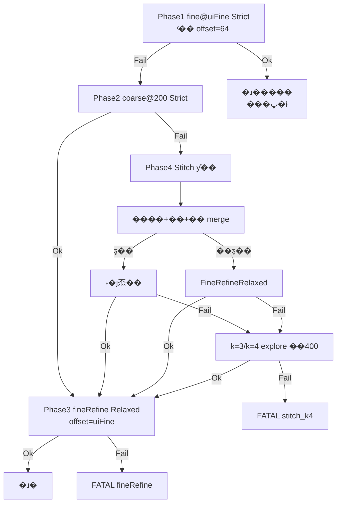

# M576 1310 ��У׼ �� �㷨����

> ���ĵ�����λ��**Ѱ�� / ɨƵ / ƴ�� / ƽ̨��**����㷨�����˵��������ά������������ⶨλ��  
> ��ϸ���ļ������� `M576Calibrator/Docs/INVARIANTS.md`��INV-10..19����`PeakFinder.md`��ƴ��״̬���� [`ƴ��ʽɨƵ�����㷨.md`](ƴ��ʽɨƵ�����㷨.md)��

---

## 1. ���ⱳ��

M576 �� 1310 nm �¶�ÿ· MEMS �� DAC ���꣺�̼� `RECAL 3/5` ɨƵ���ع������У���λ��Ѱ��õ� `Y@peak` / `X@peak`��д�� LUT ����¼��

**�̼�ɨƵ�������ޣ���λ����������Բ���**���� `CLAUDE.md`��`.cursor/rules`����

| �̼����� | ��λ������ |
|----------|------------|
| ���̶������Զ��� base | ��׶� pipeline��64 �� 200 �� ƴ�� �� ��ɨ |
| ƽ̹ / ���� / ���� | Strict / Relaxed����Ⱥ�޳���argmax ���� |
| ���ڴ��� | ƴ��ƽ�ơ���չɨ ��400 |
| **ƽ̨�壨ƽ�� mesa��** | �Գ�����ƴ�� + **˫�յ㼸������** |

����Ŀ�꣺**��������ÿһ��У׼�ɹ�**��ʧ����ṹ���������� phase����ֹ������־�жϣ�INV-15����

---

## 2. ����ֲ㣨�㷨��㣩

| �� | ·�� | ְ�� |
|----|------|------|
| Ѱ����� | `M576CalibratorApp/PeakFinder2D.cpp` | һά/��άѰ�塢������ϡ�ƽ̨˫�յ㡢`IsMergedMesaProfile` |
| ƴ�� pipeline | `M576CalibratorApp/Peak1DSweepPipeline.cpp` | Phase ״̬�����κϲ���`FindPeakDacOnMerged` |
| �ɰ� recenter | `M576CalibratorApp/Peak1DSweepRecenter.cpp` | ���ʽ planner��**���� Dlg �Ѳ���**��CrossPeakTest �����Բ⣩ |
| ���� | `M576CalibratorApp/M576Peak1DConstants.h` | ���ޡ�ƴ�Ӵ�����ɨƵӲ�� |
| UI ���� | `M576CalibratorApp/M576CalibratorDlg.cpp` | `RunRecal1DSweepWithPeakRecenterRetry`��FATAL ��־ |
| ���߻ع� | `CrossPeakTest/main.cpp` | ��Ӳ������ + comm CSV �ط� |

**��ֹ**�� Dlg ����д bin ���ֻ��ظ�ʵ��Ѱ���߼���

---

## 3. ����ɨƵ Pipeline��INV-10��

���ߵ��ᣨY Ԥɨ�� X ɨ��ͳһ�� `Peak1DSweepPipeline`��� **11 ��**Ӳ��ɨƵ��`M576_PEAK1D_PIPELINE_MAX_SWEEPS`����



### 3.1 ���׶�Ҫ��

| Phase | offset | ��ϲ��� | �ɹ���Ϊ |
|-------|--------|----------|----------|
| Fine64 | `m_dacRange`��ͨ�� 64�� | `Strict` | **ֱ�ӳɹ�**�����ٷ���ɨ |
| Coarse200 | 200 | `Strict` | ���� **FineRefine** |
| Stitch | 200 | 扫频 Strict；**k=1..4 append 后当次段 Strict Ok 才 merge**；merge 后分流 | 定出合成峰 → **FineRefine** |
| FineRefine | `m_dacRange` | `FineRefineRelaxed` | �ɹ�д LUT ǰ���һ�� |

��ɨ��λ�� Strict����ɨ�� Relaxed������ʧ�ܿ� argmax ���ˣ�INV-11����

### 3.2 ƴ��λ�ƣ�anchor = �״� @200 ɨƵ���ģ�

`anchorBase = floor(col0 + halfRange)`���������ģ�`base=9999` ռλʱ�ɹ̼� `col0` ���㣩��

| stitchK | ���� | movingBase | DAC �� [C��200] |
|---------|------|------------|----------------|
| 0 | ���� | �״� @200 | [C?200, C+200] |
| 1 | �� | C ? 200 | [C?400, C] |
| 2 | �� | C + 200 | [C, C+400] |
| 3 | explore �� | C ? 400 | [C?600, C?400] |
| 4 | explore �� | C + 400 | [C+200, C+600] |

**ÿ�� stitch append��k=1..4����**��**���ζ��� Strict ����Ѱ�� Ok** �ų��� merge��merge Ѱ�� Ok ����ͣ���� FineRefine������ʣ�� stitch����Ҫ��ϳ����� Strict Ok��

������`STITCH_UNIT_DAC=200`��`STITCH_SYMMETRIC_RETRIES=2`��`STITCH_MAX_RETRIES=4`��

### 3.3 �κϲ�

`MergeRecal1DSweepSegments`���� **DAC ����**������ @200 ���ߣ��ص����**ȡƽ��**����Ѱ�塣  
�ϲ��� `span < MinProminenceDb`��Ĭ�� 0.3 dB ��Ч raw��ֱ�� `LowSpan` �ܾ�������ƽ̹�ٷ塣

---

## 4. һάѰ�����

### 4.1 ��ϲ��ԣ�`Peak1DFitPolicy`��

| ���� | ��; | ��ΪժҪ |
|------|------|----------|
| `Strict` | fine64��coarse200��ƴ�Ӹ���ɨƵ�ж� | ƽ̹�ſء��������ߡ����׶���������ȫ |
| `FineRefineRelaxed` | ��ɨ����ƽ̨ merge����չɨ merge | ��������ƽ̹�ſأ�����ʧ�ܿ� **argmax ����** |

### 4.2 �����壨���� / ��˹�ͣ�

- `ParabolaVertexMax1D`����Ⱥ�޳������������ `t*`
- `FindUnimodalPeak1DIndex`��У��ֲ�������
- ���ڣ�fine64 / coarse200 ���Ρ�**��ƽ̨**ƴ�� merge��**k��3 ��չɨ**

### 4.3 ƽ̨�壨Flat Top / Mesa��

�����ڹ�·�Զ���׼��Active Alignment���������� �� **ƽ��ƽ̨** �� �½��أ�argmax ��ƽ̨��������������ϲ��ȶ���

**˼·**����Ե��� + �����е㣨�� FWHM / ��ֵ�е㷨ͬ�壬ʵ��Ϊ**���б��ϥ��**����

#### ���`IsMergedMesaProfile`

���� **�Գ����� merge ���**�������� mesa ʱ������˫�յ㣨������ bell ���У���

- ȫ���� `span �� Peak1DMinFlatSpanRaw()`
- argmax ������β 10%���ڷ壩
- ��/��ϥ���� �� `max(5, n��12%)`
- ϥ��������ƽ����� �� ȫ���� span �� 12%
- ���ϸ񵥵���NonMono��

#### ���壺`FindPlateauDualKneePeak1D`

| ���� | ˵�� |
|------|------|
| ��ϥ `iL` | argmax ��� **�����б��** �� |
| ��ϥ `iR` | argmax �Ҳ� **���б��** �� |
| ��λ `t*` | `(iL + iR) / 2` |

�Գ�ƽ̨������ ~30��ƽ̨ ~30�C70���½� ~70��ʱ��`t*` �� 50��**����ƽ̨������Ư��**��

#### �� FWHM �IJ���

| | FWHM / ��ֵ�е� | ��ǰ˫�յ� |
|--|-----------------|------------|
| �߽綨�� | ��ֵ��ֵ��Խ�� | ����ݶ�ϥ�� |
| �Գ�ƽ̨ | �� | �� |
| ����/�½����Ȳ��Գ� | �ɵ���ֵ | ������ƫ���� |
| ������������� | ���� | ���б�ʿ��ܱ����ǣ�� |

ƽ̨�� dual-knee **ʧ��ʱ��**��ͬ�� merge �� fallback Relaxed�����ǽ��� k=3/k=4 ��չɨ��Relaxed�������� mesa ���� argmax��

---

## 5. �ϳ�Ѱ�������`FindPeakDacOnMerged`��

```
merge ȫ�� segments
  �� span ����
  �� ��� stitchK��3���� FineRefineRelaxed
  �� ��� stitchK 0,1,2 �� IsMergedMesaProfile��FindPlateauDualKneePeak1D
  �� ����FineRefineRelaxed
  �� �ɹ��� PeakBaseFromCoarseHint ���� �� FineRefine
```

��־��Dlg����

- ƽ̨��`plateau dual_knee iL=�� iR=�� t*=��`
- ��ƽ̨��`merged unimodal relaxed t*=�� stitch_k=��`

---

## 6. ��ά����Ѱ�壨INV-19��

·������ÿ����**Y Ԥɨ** �� **X ɨ** �� `PeakCrossFrom1DScans` �� `(row,col)`��

- Y Ԥɨ�� X ɨ���� **ͬһ��** `Recal1DSweepPipeline`
- Y �ѹ���cross Y ʧ�ܣ�`PlanRecalYCrossResweepPipeline` �� hint ƽ�� `baseY` ��¯ Y��offset ��Ϊ UI `m_dacRange`��
- X cross ʧ�ܣ�����ɨ X������¯ Y
- ��������ϲ��Լ� `Peak1DFitPolicyForCrossAxis` / `Peak1DFitPolicyForSweepResult`

---

## 7. ʧ����׷��

| ���� | phase / ��Ϊ |
|------|----------------|
| ƴ�Ӻľ� | `FATAL` `stitch_k4` |
| ��ɨʧ�� | `FATAL` `fineRefine` |
| PM ��λ���� | `PmRangeMismatch`������ʧ�ܣ�INV-16�� |
| ͨ��/���� | Dlg ���У�**��**�� peak-pipeline FATAL��INV-12�� |

FATAL �����`[FATAL][peak-pipeline]` + `m576_fatal.log`���� `anchor`��`stitch_k`��`kneeL/R`��`t*`��`merged_span`��

---

## 8. �ؼ������ٲ�

| ���� | ����ֵ | ���� |
|------|--------|------|
| `M576_MAX_DAC_RANGE` | 200 | ��ɨ / ƴ�Ӱ�� |
| `m_dacRange`��UI�� | 64 | fine ��� |
| `M576_PEAK1D_MIN_PROMINENCE_DB` | 0.3 | ƽ̹/ͻ�������ޣ�INI �ɸ��ǣ� |
| `M576_PEAK1D_STITCH_MAX_RETRIES` | 4 | ƴ��ɨƵ�������� |
| `M576_PEAK1D_PIPELINE_MAX_SWEEPS` | 11 | ����Ӳ��ɨƵӲ�� |

---

## 9. �ع���֤

```text
msbuild M576Calibrator\CrossPeakTest\CrossPeakTest.vcxproj /p:Configuration=Release /p:Platform=Win32
M576Calibrator\CrossPeakTest\Release\CrossPeakTest.exe
```

`RunSweepPipelineSelfTests` ���ǣ�

- fine64 ���ֳɹ������� ~89% ·�����䣩
- 64 fail �� 200 ok �� fine
- ƴ�ӣ�k=1 �� early-stop���Գ����� bell �� Relaxed��mesa �� dual-knee
- ȫ flat �� `stitch_k4`���Գ�ʧ�ܺ� explore k=3 �ָ�
- `StitchMovingBaseFromAnchor` k=1..4

�����޻� merge �߼�ʱ **����**�� CrossPeakTest���� comm ��־ʱ�� CSV �طŶԱȡ�

---

## 10. ����ĵ�����

| �ĵ� | ���� |
|------|------|
| [`ƴ��ʽɨƵ�����㷨.md`](ƴ��ʽɨƵ�����㷨.md) | Pipeline ״̬����λ�Ʊ��FATAL Լ�� |
| [`�����ѵ�ܽ�.md`](�����ѵ�ܽ�.md) | ��Ŀ��ʱ���򡢹̼� vs ��λ���ֹ� |
| `M576Calibrator/Docs/INVARIANTS.md` | INV-10..19 ������ |
| `M576Calibrator/Docs/PeakFinder.md` | Ѱ�� API��validate_code��Ԥ���� |
| `M576Calibrator/Docs/LUT_INDEXING.md` | LUT ��λ�� Merge д�� |
| `��������ͼ.png` / [`�豸����ͼ.png`](�豸����ͼ.png) | ��·�뿪�ؼ��� |

---

## 11. ���ԭ�򣨸��㷨ǰ�Լ죩

1. ���� / ��� / ʧ�����Ƿ���ȷ��
2. �ܷ� `CrossPeakTest` �� comm �طŸ��ǣ�
3. �Ƿ񶯵�δУ׼ LUT ��λ������ LUT ����
4. PM Run Path �Ƿ��� RECAL 0 ���� `opm 4 1` �˶Ե�λ����INV-17��
5. ƽ̨�壺���� **�����ԡ���׷��**��δ�Ĺ̼�ǰ��ɾƴ�� / ��չɨ·����

---

*�ĵ��汾��2026-07����Գ�����ƴ�� + ƽ̨�����Ѱ��ʵ��ͬ����*
