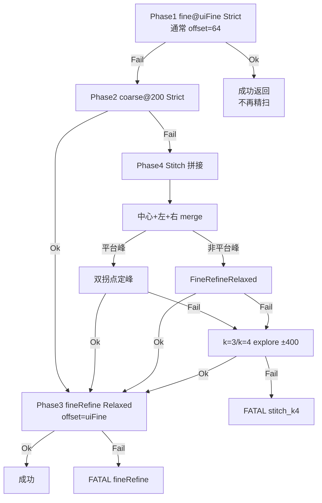

# M576 1310 自校准 ― 算法总览

> 本文档是上位机**寻峰 / 扫频 / 拼接 / 平台峰**相关算法的入口说明，面向维护者与产线问题定位。  
> 详细条文见工程内 `M576Calibrator/Docs/INVARIANTS.md`（INV-10..19）、`PeakFinder.md`；拼接状态机见 [`拼接式扫频重试算法.md`](拼接式扫频重试算法.md)。

---

## 1. 问题背景

M576 在 1310 nm 下对每路 MEMS 做 DAC 定标：固件 `RECAL 3/5` 扫频返回功率序列，上位机寻峰得到 `Y@peak` / `X@peak`，写入 LUT 并烧录。

**固件扫频能力有限，上位机用软件策略补洞**（见 `CLAUDE.md`、`.cursor/rules`）：

| 固件弱项 | 上位机补偿 |
|----------|------------|
| 窗固定、难自动定 base | 多阶段 pipeline：64 → 200 → 拼接 → 精扫 |
| 平坦 / 弱峰 / 贴边 | Strict / Relaxed、离群剔除、argmax 回退 |
| 峰在窗外 | 拼接平移、扩展扫 ±400 |
| **平台峰（平顶 mesa）** | 对称三段拼接 + **双拐点几何中心** |

产线目标：**尽可能让每一次校准成功**；失败须结构化错误码与 phase，禁止仅靠日志判断（INV-15）。

---

## 2. 代码分层（算法落点）

| 层 | 路径 | 职责 |
|----|------|------|
| 寻峰核心 | `M576CalibratorApp/PeakFinder2D.cpp` | 一维/二维寻峰、三阶拟合、平台双拐点、`IsMergedMesaProfile` |
| 拼接 pipeline | `M576CalibratorApp/Peak1DSweepPipeline.cpp` | Phase 状态机、段合并、`FindPeakDacOnMerged` |
| 旧版 recenter | `M576CalibratorApp/Peak1DSweepRecenter.cpp` | 启发式 planner（**产线 Dlg 已不用**；CrossPeakTest 遗留自测） |
| 常量 | `M576CalibratorApp/M576Peak1DConstants.h` | 门限、拼接次数、扫频硬顶 |
| UI 编排 | `M576CalibratorApp/M576CalibratorDlg.cpp` | `RunRecal1DSweepWithPeakRecenterRetry`、FATAL 日志 |
| 离线回归 | `CrossPeakTest/main.cpp` | 无硬件单测 + comm CSV 回放 |

**禁止**在 Dlg 内重写 bin 布局或重复实现寻峰逻辑。

---

## 3. 单轴扫频 Pipeline（INV-10）

产线单轴（Y 预扫或 X 扫）统一走 `Peak1DSweepPipeline`，最坏 **11 次**硬件扫频（`M576_PEAK1D_PIPELINE_MAX_SWEEPS`）。



### 3.1 各阶段要点

| Phase | offset | 拟合策略 | 成功行为 |
|-------|--------|----------|----------|
| Fine64 | `m_dacRange`（通常 64） | `Strict` | **直接成功**，不再发精扫 |
| Coarse200 | 200 | `Strict` | 进入 **FineRefine** |
| Stitch | 200 | 扫频 Strict；merge 后分流 | 定出合成峰 → **FineRefine** |
| FineRefine | `m_dacRange` | `FineRefineRelaxed` | 成功写 LUT 前最后一轮 |

粗扫定位用 Strict；精扫用 Relaxed（三阶失败可 argmax 回退，INV-11）。

### 3.2 拼接位移（anchor = 首次 @200 固件 `col0`）

`anchorBase = floor(col0)`，**不是** `movingBase=9999` 占位值。

| stitchK | 方向 | movingBase | 是否 merge |
|---------|------|------------|------------|
| 0 | 中心 | 首次 @200 | 否（append 段） |
| 1 | 左 | anchor ? 200 | **否**（仅采集） |
| 2 | 右 | anchor + 200 | **是**（中心+左+右） |
| 3 | explore 左 | anchor ? 400 | 是（仅 Relaxed） |
| 4 | explore 右 | anchor + 400 | 是（仅 Relaxed） |

常量：`STITCH_UNIT_DAC=200`，`STITCH_SYMMETRIC_RETRIES=2`，`STITCH_MAX_RETRIES=4`。

### 3.3 段合并

`MergeRecal1DSweepSegments`：按 **DAC 坐标**对齐多段 @200 曲线，重叠格点**取平均**，再寻峰。  
合并后 `span < MinProminenceDb`（默认 0.3 dB 等效 raw）直接 `LowSpan` 拒绝，避免平坦假峰。

---

## 4. 一维寻峰策略

### 4.1 拟合策略（`Peak1DFitPolicy`）

| 策略 | 用途 | 行为摘要 |
|------|------|----------|
| `Strict` | fine64、coarse200、拼接各段扫频判定 | 平坦门控、单调贴边、三阶顶点门限齐全 |
| `FineRefineRelaxed` | 精扫、非平台 merge、扩展扫 merge | 跳过部分平坦门控；三阶失败可 **argmax 回退** |

### 4.2 常规尖峰（单峰 / 高斯型）

- `ParabolaVertexMax1D`：离群剔除后三阶拟合求 `t*`
- `FindUnimodalPeak1DIndex`：校验局部单峰性
- 用于：fine64 / coarse200 单段、**非平台**拼接 merge、**k≥3 扩展扫**

### 4.3 平台峰（Flat Top / Mesa）

典型于光路自动对准（Active Alignment）：上升沿 → **平顶平台** → 下降沿；argmax 在平台上乱跳，三阶拟合不稳定。

**思路**：边缘检测 + 几何中点（与 FWHM / 阈值中点法同族，实现为**最大斜率膝点**）。

#### 判定：`IsMergedMesaProfile`

仅当 **对称三段 merge 完成**且曲线像 mesa 时，才走双拐点（避免尖峰 bell 误判）：

- 全序列 `span ≥ Peak1DMinFlatSpanRaw()`
- argmax 不在首尾 10%（内峰）
- 左/右膝点间距 ≥ `max(5, n×12%)`
- 膝点区间内平顶起伏 ≤ 全序列 span 的 12%
- 非严格单调（NonMono）

#### 定峰：`FindPlateauDualKneePeak1D`

| 步骤 | 说明 |
|------|------|
| 左膝 `iL` | argmax 左侧 **最大正斜率** 点 |
| 右膝 `iR` | argmax 右侧 **最大负斜率** 点 |
| 峰位 `t*` | `(iL + iR) / 2` |

对称平台（上升 ~30、平台 ~30�C70、下降 ~70）时，`t*` ≈ 50，**不随平台顶噪声漂移**。

#### 与 FWHM 的差异

| | FWHM / 阈值中点 | 当前双拐点 |
|--|-----------------|------------|
| 边界定义 | 幅值阈值穿越点 | 最大梯度膝点 |
| 对称平台 | 好 | 好 |
| 上升/下降陡度不对称 | 可调阈值 | 中心略偏陡侧 |
| 肩上有噪声尖刺 | 较稳 | 最大斜率可能被尖刺牵引 |

平台峰 dual-knee **失败时不**在同次 merge 上 fallback Relaxed，而是进入 k=3/k=4 扩展扫（Relaxed），避免 mesa 误用 argmax。

---

## 5. 合成寻峰分流（`FindPeakDacOnMerged`）

```
merge 全部 segments
  → span 门限
  → 若含 stitchK≥3：仅 FineRefineRelaxed
  → 若含 stitchK 0,1,2 且 IsMergedMesaProfile：FindPlateauDualKneePeak1D
  → 否则：FineRefineRelaxed
  → 成功则 PeakBaseFromCoarseHint 定心 → FineRefine
```

日志（Dlg）：

- 平台：`plateau dual_knee iL=… iR=… t*=…`
- 非平台：`merged unimodal relaxed t*=… stitch_k=…`

---

## 6. 二维交叉寻峰（INV-19）

路径定标每步：**Y 预扫** → **X 扫** → `PeakCrossFrom1DScans` 得 `(row,col)`。

- Y 预扫与 X 扫各走 **同一套** `Recal1DSweepPipeline`
- Y 已过、cross Y 失败：`PlanRecalYCrossResweepPipeline` 按 hint 平移 `baseY` 重炉 Y（offset 仍为 UI `m_dacRange`）
- X cross 失败：仅重扫 X，不重炉 Y
- 交叉轴拟合策略见 `Peak1DFitPolicyForCrossAxis` / `Peak1DFitPolicyForSweepResult`

---

## 7. 失败与追溯

| 场景 | phase / 行为 |
|------|----------------|
| 拼接耗尽 | `FATAL` `stitch_k4` |
| 精扫失败 | `FATAL` `fineRefine` |
| PM 挡位不符 | `PmRangeMismatch`，立即失败（INV-16） |
| 通信/串口 | Dlg 另判，**不**记 peak-pipeline FATAL（INV-12） |

FATAL 输出：`[FATAL][peak-pipeline]` + `m576_fatal.log`，含 `anchor`、`stitch_k`、`kneeL/R`、`t*`、`merged_span`。

---

## 8. 关键常量速查

| 常量 | 典型值 | 含义 |
|------|--------|------|
| `M576_MAX_DAC_RANGE` | 200 | 粗扫 / 拼接半宽 |
| `m_dacRange`（UI） | 64 | fine 半宽 |
| `M576_PEAK1D_MIN_PROMINENCE_DB` | 0.3 | 平坦/突出度门限（INI 可覆盖） |
| `M576_PEAK1D_STITCH_MAX_RETRIES` | 4 | 拼接扫频次数上限 |
| `M576_PEAK1D_PIPELINE_MAX_SWEEPS` | 11 | 单轴硬件扫频硬顶 |

---

## 9. 回归验证

```text
msbuild M576Calibrator\CrossPeakTest\CrossPeakTest.vcxproj /p:Configuration=Release /p:Platform=Win32
M576Calibrator\CrossPeakTest\Release\CrossPeakTest.exe
```

`RunSweepPipelineSelfTests` 覆盖：

- fine64 单轮成功（主流 ~89% 路径不变）
- 64 fail → 200 ok → fine
- 拼接：k=1 不 early-stop；对称三段 bell → Relaxed；mesa → dual-knee
- 全 flat → `stitch_k4`；对称失败后 explore k=3 恢复
- `StitchMovingBaseFromAnchor` k=1..4

改门限或 merge 逻辑时 **必须**跑 CrossPeakTest；有 comm 日志时做 CSV 回放对比。

---

## 10. 相关文档索引

| 文档 | 内容 |
|------|------|
| [`拼接式扫频重试算法.md`](拼接式扫频重试算法.md) | Pipeline 状态机、位移表、FATAL 约定 |
| [`经验教训总结.md`](经验教训总结.md) | 项目耗时根因、固件 vs 上位机分工 |
| `M576Calibrator/Docs/INVARIANTS.md` | INV-10..19 不变量 |
| `M576Calibrator/Docs/PeakFinder.md` | 寻峰 API、validate_code、预处理 |
| `M576Calibrator/Docs/LUT_INDEXING.md` | LUT 槽位与 Merge 写回 |
| `物理拓扑图.png` / [`设备开关图.png`](设备开关图.png) | 光路与开关级联 |

---

## 11. 设计原则（改算法前自检）

1. 输入 / 输出 / 失败码是否明确？
2. 能否 `CrossPeakTest` 或 comm 回放覆盖？
3. 是否动到未校准 LUT 槽位？（见 LUT 规则）
4. PM Run Path 是否在 RECAL 0 后用 `opm 4 1` 核对挡位？（INV-17）
5. 平台峰：优先 **可重试、可追溯**；未改固件前勿删拼接 / 扩展扫路径。

---

*文档版本：2026-07；与对称三段拼接 + 平台峰分流寻峰实现同步。*
