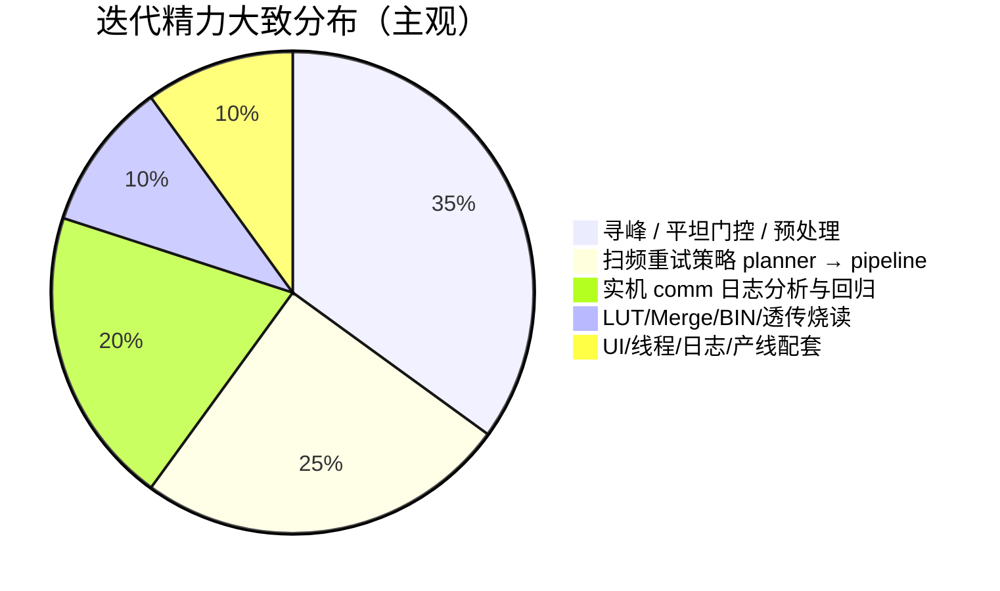

# M576 1310 自校准上位机 ― 经验教训总结

> 本文档总结本项目（Windows MFC + 单串口 439F + Z4671 兼容 BIN）从需求到产线可用的**实际耗时原因**、**技术难点**与**反复迭代**的根因，供后续维护、交接与类似项目参考。  
> 撰写时间：2026-07。

---

## 1. 为什么「看起来是小项目」却耗时长

### 1.1 表面规模 vs 真实复杂度

| 表面认知 | 实际情况 |
|----------|----------|
| 「加一个 1310 波长、复用 Z4671 读写烧录」 | 1310 只是**新增一套 LUT 槽位与 Merge 规则**；核心难点在 **RECAL 扫频 + 寻峰 + 重试** |
| 「1286 步循环发命令」 | 每步含 **Y 预扫 → X 扫 → 二维交叉寻峰 → LUT 写入**；单步失败会 **多轮 RECAL、扩窗、拼接** |
| 「MFC 对话框 + 串口」 | 四级光开关拓扑、2×MCS + 2×1×64、PM/PD 双模式、透传 trans/$$、**工作线程 + UI 日志洪峰** |
| 「寻峰就是拟合抛物线」 | 固件占位、无效功率、平坦/单调/贴边/离群/PM 挡位 ― **多层门限 + 与固件能力缺口叠加** |

PRD 描述的是**业务步骤**（读 BIN → 定标 → 写 BIN → 烧录），实现中 **80% 以上的迭代**集中在：**RECAL 3/5 一维扫频在边界数据上如何稳定过峰**，而不是 BIN 布局本身。

### 1.2 时间花在哪里（经验占比）



- **无法只靠单元测试闭环**：必须 **实机或 comm CSV 回放**；一次 Run Path 数小时，失败 step 分散在 ~576×多 slot。
- **固件行为与文档不同步**：如 `baseY=9999` 表示「读当前 LUT DAC」，回报 **col0 才是真实窗起点**；理解偏差直接导致拼接发错窗（9799 vs -270）。
- **老 Z4671 约束**：BIN 布局、CRC、透传协议不能重写，只能在 App 层堆策略兜底。

---

## 2. 难在哪里

### 2.1 物理与协议层

- **拓扑复杂**：SW1→SW2/3/4 级联，MCS 576 路 + 1×64 多 MEMS；路径 CSV、PM 1×64 映射、CH 与 LUT 下标多处 **INV 约束**（见 `INVARIANTS.md`、`LUT_INDEXING.md`）。
- **单串口多角色**：RECAL ASCII + Z4671 二进制透传；超时、重试、Stop 与 UI 进度竞态。
- **9999 语义**：`M576_RECAL_FW_READ_BASE_DAC` 是占位，**不是 DAC 坐标**；扫频几何必须用 **`[col0]` + offset/step** 还原，否则 retry 位移无意义。

### 2.2 算法层（最难、迭代最多）

**固件扫频能力有限，上位机用软件策略补洞**（项目规则已写明）：

| 固件侧弱项 | 上位机补偿 |
|------------|------------|
| 扫频窗固定、难自动定 base | `PlanNext…` / **Pipeline** 多 phase：64 → 200 → 拼接 → 精扫 |
| 平坦/弱峰/贴边 | Strict vs Relaxed、离群剔除、肩窗、argmax 回退 |
| 偶发尖峰、非对称肩 | outlier pass、MinProminenceDb 门控 |
| 峰在窗外 | VertexOutOfRange → recenter / stitch |

难点在于：**同一套门限要同时满足**

- 产线 **~89% 首轮 @64 即 Ok**（不能改坏主流）；
- 少数边界 step **可恢复、可追溯**；
- **CrossPeakTest + comm 回放** 可回归。

### 2.3 工程层

- **MFC + 工作线程**：`SafeAppendLog`、路径线程、禁止 UI 阻塞串口；曾出现 **friend/私有访问**、日志批量 flush 等细节 bug。
- **分层约束**：Z4671Core 无对话框；算法应在 `PeakFinder2D` / `Peak1DSweepPipeline`，Dlg 只编排 ― 违反则难测难改。
- **文档与代码双轨**：`INVARIANTS.md`、`.cursor/rules`、`PeakFinder.md` 需与改门限/sync 同步，否则 AI/新人按旧 INV 改会 **反复踩坑**。

---

## 3. 为什么反复折腾

### 3.1 需求从「能跑」演进到「产线成功率」

早期目标：**跑通 Read → Calibrate → Write → Burn**。  
产线暴露后：**单 step 失败率、FATAL 可定位、PM 挡位一致、comm 可追溯** 成为主矛盾。

策略从 **启发式 planner**（Flat/Mono/ShiftOnly/JumpFlatMax/ping-pong，最多 12 次）演进到 **确定性 Pipeline**（64→200→拼接→精扫），不是一次设计到位，而是 **comm 日志驱动** 多轮收敛。

### 3.2 门限「多套并行」导致认知混乱

历史上同时存在：

- **0.3 dB**（MinProminenceDb，预处理前 span）；
- **2.5 dB**（MIN_SPAN_DB，recenter Flat）；
- **relFlat**（相对平坦）。

三套含义重叠，**改一处、坏另一处**；后统一为 **离群剔除后 useOk span ≥ MinProminenceDb**（2026-07），才减少「边界曲线该 Flat 还是 NonMono」的争论。

### 3.3 拼接策略的两次关键修正

| 版本问题 | 现象 | 修正 |
|----------|------|------|
| anchor = `movingBase`（9999） | stitch 发 `9799`，col0≈9599，完全扫错窗 | anchor = **固件 col0**（如 -70 → k1 发 -270） |
| 精扫 offset = uiFineRange/2（32） | 粗扫 OK 后窗过窄，与 UI m_dacRange 不一致 | 精扫 **offset = m_dacRange（64）** |

两次都是 **实机 FATAL + segment 日志** 才定位；单测若只用 `movingBase=1000` 的理想几何，**测不出 9999 占位 bug**。

### 3.4 失败类型混杂，易误判为「算法不行」

实机 FATAL 日志中常见 **三类不同根因**：

1. **Pipeline 耗尽 / VOR** ― 扫窗/拼接/精扫仍找不到合法峰（算法与光路）。  
2. **PmRangeMismatch** ― 找到峰但 **dBm 不在 PM 挡位**（INV-16，配置/光学，非 recenter 能解）。  
3. **通信/超时** ― 与 peak-pipeline 无关，需看 comm 超时与 RECAL 重试。

若不拆分，会出现在 **PM 挡位** 上继续加 recenter，徒劳无功。

### 3.5 回归集与「冻结主流」的拉扯

- CrossPeakTest + `comm_*_recal_sweeps.csv` 要求 **fit_ok/csv ≥ ~0.95**，且 **首轮 @64 Ok 的 step 不能回归变差**。
- 任一放宽门限（2.5→0.3）或改 pipeline，都要 **全量 exe + 抽样 comm 统计**；反馈周期长，表现为「改一点、测一天、再改一点」。

---

## 4. 典型踩坑案例（便于后人避坑）

### 4.1 step=169：拼接锚点错误（2026-07-04 FATAL）

```
segment[0] col0=-70  argmax=0  （峰贴左缘，真实峰可能在窗外）
segment[1] base=9799 col0=9599 span=0  （错窗，应为 base≈-270）
→ fineRefine VertexOutOfRange
```

**教训**：`baseY=9999` 仅表示读 LUT；**拼接位移必须基于 col0**。

### 4.2 平坦门控时机

门控放在 **离群剔除前** 时，单侧尖峰抬高 span，**该过的 Strict 被拒**；后移到 **useOk 后** 才符合「去非对称后再比 max?min」。

### 4.3 planner 与 pipeline 并存期

产线已切 **Peak1DSweepPipeline**，旧 `PlanNextRecal1DSweepAttempt` 仍留 CrossPeakTest ― 文档/日志若混用两套语义，排查时会 **对着旧 planner 解释新 FATAL**。

---

## 5. 做对了什么（应坚持）

1. **INVARIANTS + CrossPeakTest**：算法改动必跑 `CrossPeakTest.exe`；comm 回放冻结主流。  
2. **结构化失败**：`Peak1DValidateCode`、phase（fine64/coarse200/stitch_kN/fineRefine）、`[FATAL][peak-pipeline]` + `m576_fatal.log`。  
3. **comm CSV 实时落盘**：`output/comm_*_recal_sweeps.csv` 是 **实机迭代的主数据源**。  
4. **分层**：Pipeline/PeakFinder 可单测；Dlg 只编排。  
5. **产线可调 INI**：`MinProminenceDb` 等，避免为边界个案反复编译。

---

## 6. 若重来或做类似项目，建议

| 建议 | 说明 |
|------|------|
| **尽早冻结 RECAL 几何契约** | col0、baseY、offset、movingBase 换算写进一页「扫频坐标系」，与固件对齐签字 |
| **9999 / 占位符单独成章** | 凡占位命令，**禁止**参与 ±range 算术 |
| **先 comm 回放框架，再堆 planner** | CrossPeakTest + CSV 应在 **第一版寻峰** 时就接好 |
| **策略版本化** | Pipeline phase 名、门限常量、变更日期写入 INVARIANTS，避免「口头新策略、代码旧分支」 |
| **失败 taxonomy 先行** | 算法失败 / PM 挡位 / 通信 / 用户 Stop ― UI 与 FATAL 分通道统计 |
| **控制 heuristic 膨胀** | 启发式分支 >3 层就考虑 **状态机重写**（本项目 planner→pipeline 即如此） |
| **小步发布 + 单变量实验** | 同时改门限 + 拼接 + 精扫 offset 时，无法归因 |

---

## 7. 项目现状一句话

这是一个 **「产线工具 + 半套 ATE」**：业务外壳是 Z4671 兼容的 BIN 读写烧录，**核心竞争力在 1310nm 下 1286 步 RECAL 寻峰的稳定性**；耗时长不是因为 MFC 或 BIN 格式，而是因为 **在固件能力边界上，用可回归的上位机策略把成功率从「多数能过」推到「边界也能恢复且可解释」** ― 且该过程高度依赖 **实机 comm 日志与多轮策略重构**。

---

## 8. 相关文档索引

| 文档 | 用途 |
|------|------|
| [`CLAUDE.md`](../CLAUDE.md) | 架构与 ATE 原则 |
| [`M576Calibrator/Docs/INVARIANTS.md`](../M576Calibrator/Docs/INVARIANTS.md) | 不可破坏约束（INV-01..22） |
| [`M576Calibrator/Docs/PeakFinder.md`](../M576Calibrator/Docs/PeakFinder.md) | 寻峰与 pipeline |
| [`doc/拼接式扫频重试算法.md`](拼接式扫频重试算法.md) | 64→200→拼接→精扫 |
| [`M576Calibrator/Docs/算法优化TODO.md`](../M576Calibrator/Docs/算法优化TODO.md) | 算法 backlog 与状态 |
| [`doc/需求Spec PRD.md`](需求Spec PRD.md) | 原始需求与 1286 步 |

---

*本文档随重大策略变更（如 pipeline、门限、拼接锚点）应增补一节「变更记录」，避免重复同类折腾。*
