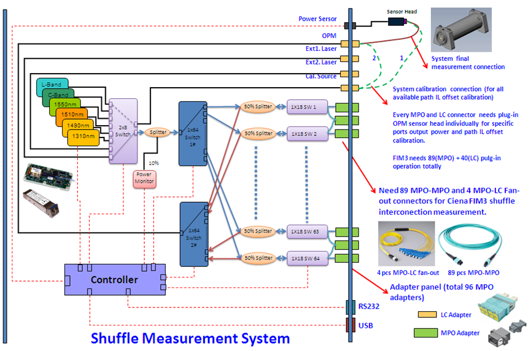
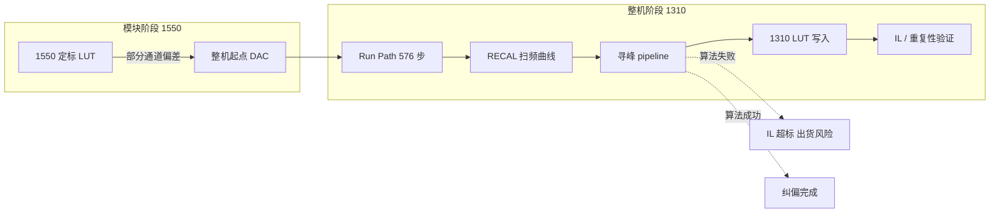

# M576 1310 自校准项目 — 深度理解总结

> 本文档从**业务根因、整机纠偏动机、Run Path 寻峰关键性**三个层面，总结我们对本项目的共同理解。  
> 撰写时间：2026-07-10；**2026-07-13**：已移除 mesa/dual_knee，三段 merge 改 FineRefineRelaxed 单峰。与 [`需求Spec PRD.md`](需求Spec%20PRD.md)、[`经验教训总结.md`](经验教训总结.md)、[`算法总览.md`](算法总览.md) 配套阅读。

---

## 1. 一句话定位

**M576 1310 自校准上位机，是在整机出货前，用 1310 nm 光路与功率计/PD，对四级级联光开关上全部 MEMS 通道重新定标 DAC，并把结果写入 Z4671 兼容 BIN、烧录回子模块的产线工具。**

表面上是「加一个 1310 波长」；**实质是在整机阶段，把模块级（尤其 1550 nm）定标遗留的光路偏差，用 1310 Run Path 的逐路寻峰再校准回来。**

---

## 2. 为什么存在这个项目

### 2.1 上游：1550 模块定标并不总是「足够准」

M576 产品在**模块阶段**已有一套成熟的定标流程（传统上以 **1550 nm** 为主波长）。子模块（2×MCS、2×1×64 等）在模块产线上完成 MEMS DAC 表写入后，整机装配、级联、短接 MPO 之后，光路几何与模块单机状态已发生变化。

更关键的是：**部分通道在 1550 模块定标阶段就存在偏差**——不是每一路的 LUT 起点都落在真实光斑中心附近。这些偏差在模块级可能未暴露，或仅在边界路径上表现为 IL 偏大。

### 2.2 整机阶段：必须在 1310 下「再校准一遍」

客户与产线需要 **1310 nm** 规格。整机短接 32×18=576 条光路后，上位机按路径表（Run Path）逐步执行：

1. **Read Bin** — 透传读四路子模块 backup  
2. **Calibrate** — 每步 `RECAL 1` 定路 + `RECAL 3/5` 扫频寻峰  
3. **Write Bin** — 将 1310 低温槽 DAC 合并进 backup  
4. **Burn Flash** — 透传烧录  

**整机 1310 校准的目的，不仅是「写一张 1310 表」，更是利用实机光功率反馈，把各 MEMS 轴的 DAC 从「1550 遗留的近似值」拉到「1310 实光路下的真实峰位」。**

### 2.3 商业与技术双目标

| 维度 | 目标 |
|------|------|
| 商业 | 支持 1310 nm 客户/模块，与 1550 共线生产、可版本化出货 |
| 技术 | 576 路 × 多 slot（1#MCS / 2#MCS / 1×64）DAC 自动化定标，IL 与重复性达标 |
| 工程 | 通信可追溯、算法可回归、BIN 与 Z4671 老工具兼容 |

---

## 3. 物理拓扑与「上位机」的含义



光从 COM 进入 SW1，经 SW2/3/4 级联，配合 2×MCS（各 32×18）与 2×1×64，组合出 **576 条唯一光路径**。每一步 Run Path 对应：

- 一条 **MPO 入 → MPO 出** 的端到端光路  
- 若干 **MEMS 开关** 需要同时调到正确 DAC（X/Y 两轴）  
- 功率计或 PD 读回 **单点或扫频功率曲线**  

上位机通过单串口 **439F**，经 `trans` / `$$` 透传控制子模块，发 `RECAL` ASCII 扫频，收功率序列，**算峰、写 LUT、再烧录**。  
因此：**上位机的核心价值不在 MFC 界面，而在「每步能否从功率曲线里找到正确峰并落盘」。**

---

## 4. 核心矛盾：1550 若准确，寻峰很简单；1550 不准，算法成关键

### 4.1 「理想世界」：1550 定标准确

若模块级 1550 定标已将每路 MEMS 的 `baseX/baseY` 落在**真实光斑中心附近**（距峰通常在一个 fine 窗宽内），则 1310 Run Path 上固件 `RECAL 3/5` 扫频时：

```
fine64 @±64  →  曲线呈单峰 / 弱肩  →  三阶（抛物线）拟合  →  一次成功
```

即 PRD 所述的 **粗扫 + 细扫 + 抛物线顶点** 的「正常三阶拟合」路径。此时：

- 不需要扩窗到 ±200  
- 不需要左右拼接 stitch  
- 不需要平台峰（mesa）双拐点  
- cross Y / cross X 均有有效功率点  

**产线经验：约 89% 的路径在 Phase1 fine64 即可 Ok**——这些就是「1550 遗留 LUT 仍足够好」或「1310 光路仍落在峰附近」的幸运路径。

### 4.2 「现实世界」：1550 部分不准 → 必须靠上位机算法纠偏

当 1550 模块定标**偏离真实峰位**时（平移、贴边、弱峰、平坦平台、单调肩等），1310 下首次 `RECAL 3` 扫频得到的曲线**不再是标准单峰**：

| 扫频现象 | 含义 | 若只做「正常三阶拟合」 |
|----------|------|------------------------|
| Flat（span 低于门限） | 窗内几乎无峰，峰在窗外 | 拒峰或 argmax 落在平台任意点 |
| Mono / 贴边 | 峰在窗缘或窗外 | VertexOutOfRange |
| 弱肩 / 离群点 | 非对称噪声 | Strict 拒峰 |
| 宽平台（mesa） | Active Alignment 类平坦顶 | argmax 不稳定，峰位漂移 |

此时**不能**假设「再拟合一次抛物线就会好」，而需要上位机 **多阶段 pipeline** 主动纠偏：

```
fine64 Strict
  → 失败则 coarse200 Strict
  → 仍失败则 stitch 左右/扩展拼接（k=0..4）
  → 合成曲线寻峰（单峰 / mesa 双拐点）
  → fineRefine Relaxed 精扫
  → 二维 cross（Y 预扫 + X 扫）
```

**这套 pipeline 的存在理由，正是为了服务「1550 不准、首轮 fine64 过不了」的那部分路径——用软件策略在固件固定扫频窗的约束下，把峰找回来。**

### 4.3 1550 PD 验证 vs 1310 校准 IL：谁说明问题

挂机不良通道对比（`挂机不良通道SN.xlsx` → `diff.csv`）显示：

- 同一路径、同一 SN：**1550 PD 测 IL 正常**（例如 MAX−MIN < 0.25 dB）  
- **1310 校准后 IL 极差**（例如 MAX−MIN > 3 dB）  

这说明：**光路物理上并非「坏通道」，而是 1310 定标写入了错误 DAC**；1550 方法在该路径上仍可信，1310 Run Path 寻峰/落盘链出了问题。  
进一步印证：**问题焦点在 1310 校准算法，而非「1550 准所以 1310 物理一定好」的简单对立——而是「1550 模块 LUT 作起点 + 1310 寻峰必须兜底」。**

---

## 5. Run Path 与寻峰算法为何是「关键中的关键」

### 5.1 Run Path 是什么

Run Path 是按 `path_0330`（或导出 CSV）驱动的 **576 步（× 多 RECAL slot）** 自动循环：

| 步骤 | 指令语义 | 上位机职责 |
|------|----------|------------|
| 定路 | `RECAL 1 3/4 …` 等 | 选 MCS / 1×64 通道组合 |
| Y 预扫 | `RECAL 3 0 baseY 9999 offset step` | 跑 pipeline，得 `Y@peak` |
| X 扫 | `RECAL 3 1 Y@peak 9999 …` | 得 `X@peak` |
| 落盘 | Merge → Write BIN | 写 `wCalibPtrDAC[sw][LOW][ch][0/1]` |

**每一步失败或写错 DAC，都会直接变成该路径的 IL 不良**——没有「后面再平均掉」的机会。

### 5.2 寻峰算法在价值链上的位置



- **BIN 读写烧录**：复用 Z4671，成熟、风险低  
- **路径编排 / 线程 / 日志**：工程量大，但模式清晰  
- **寻峰 pipeline**：边界数据多、与固件占位语义（`base=9999`→`col0`）纠缠、需 comm 回放回归 — **决定产线成功率与 IL 上限**

因此团队共识：**Run Path 里的寻峰算法，是本项目的技术护城河，也是迭代最密集、最耗实机时间的部分。**

### 5.3 固件能力有限，上位机「补洞」是设计原则

固件 `RECAL` 扫频：

- 窗宽、步进、delay 由指令参数决定，**不会**根据曲线形状自动换策略  
- `base=9999` 表示读当前 LUT，真实几何起点在回报 **`col0`**  
- 对平坦、平台、峰在窗外等情况**无智能重扫**  

上位机必须用 **Peak1DSweepPipeline + PeakFinder2D** 实现：

- 可重试、可恢复（扩窗、平移 base、拼接）  
- 可区分通信失败 vs 寻峰失败（INV-12）  
- 可追溯（validate_code、phase、attempt、FATAL 日志）  
- 可单测（CrossPeakTest + comm CSV 回放）  

**这是在「1550 不准」前提下，整机仍能纠偏回来的唯一软件手段。**

---

## 6. 算法结构速览（与「三阶拟合」的关系）

### 6.1 正常路径 = 三阶拟合成功

对多数 step：

1. **Phase1** `fine64` Strict — 离群剔除后单峰，抛物线顶点 `t*`  
2. 直接得到 DAC，进入 cross X  
3. 无需 Phase2/3/4  

这就是用户所说的 **「正常三阶拟合，肯定成功」** 的产线主流。

### 6.2 纠偏路径 = 三阶拟合不够，pipeline 接力

对 1550 遗留偏差大的 step（尤其 slot2 的 Y 轴）：

| Phase | 作用 | 相对「只拟合一次」多做了什么 |
|-------|------|------------------------------|
| coarse200 | 扩窗找粗峰 | 把峰拉进可拟合范围 |
| stitch k1..k4 | 左右平移拼接 | 峰在窗外时拼出完整曲线 |
| mesa dual_knee | 平台峰定粗位 | 避免 argmax 在平台上乱跳 |
| fineRefine | 以粗峰为 base 再扫 ±64 | 把粗位收敛到可写 LUT 的精位 |
| cross 重炉 | Y 过了但 cross 失败 | 同一 pipeline 再跑一轮 |

详见 [`算法总览.md`](算法总览.md)、[`拼接式扫频重试算法.md`](拼接式扫频重试算法.md)、`M576Calibrator/Docs/INVARIANTS.md` INV-10..19。

### 6.3 算法迭代的教训（07-08 事故）

**拼接 + mesa 是为了更好处理 1550 不准导致的 Flat/平台扫频**；但若 mesa 分支 **跳过 fineRefine、用错误 DAC 公式落盘、cross Y 功率为 0 仍写入**，会把「纠偏」变成「写错」——IL 从 0.1 dB 级恶化到 3 dB 级。

典型路径 step 551（MPO46-11→MPO94-11）三天 comm 对比：

| 日期 | slot1 `RECAL 1 3` | slot2 `RECAL 1 4` |
|------|-------------------|-------------------|
| 07-06 / 07-07 | fine64 成功，Y≈+536 | Flat → fineRefine，Y≈−185，cross 正常 |
| 07-08 | fine64 成功，Y≈+539 | mesa 直成功，Y=**−495**，cross Y **功率=0** |

**slot1 稳定说明光路与主流算法正常；slot2 在 07-08 的算法回归说明：纠偏链路必须「找对峰 + 配对 DAC + 门控 cross」，缺一不可。**

---

## 7. 业务主流程（不变顺序语义）

```
Read Bin  →  Calibrate (Run Path)  →  Write Bin  →  Burn Flash  →  IL/重复性验证
```

- **Read Bin**：透传读 2×MCS + 2×1×64 backup，保留 SN33/34、未校准 ch  
- **Calibrate**：PM 或 PD 模式；PM 下 RECAL 0 后须 `opm 4 1` 核对挡位（INV-17）  
- **Write Bin**：仅合并本次 session 校准过的 `(sw,ch)`；1310 只写低温槽（INV-01）  
- **Burn Flash**：透传烧录，失败可回滚 backup  

寻峰失败须 **结构化 FATAL**，禁止仅靠 `LogInfo` 判断成败（INV-15）。

---

## 8. 分层架构（维护边界）

| 层 | 位置 | 职责 |
|----|------|------|
| Z4671Core | `M576Calibrator/Z4671Core/` | 串口、BIN 布局、CRC；无 MFC |
| App 编排 | `M576CalibratorApp/` | UI、Run Path、RECAL、寻峰、Merge、烧读 |
| 离线验证 | `CrossPeakTest/` | 寻峰/拼接/comm 回放，无硬件 |

**禁止**在 Dlg 里重写 bin 布局或重复实现 pipeline；算法改动须同步 CrossPeakTest 与 `M576Peak1DConstants.h`。

---

## 9. 成功标准（DoD）

| 类别 | 标准 |
|------|------|
| 产线 | 576 路 Run Path 完成率、IL/重复性达标；边界路径可恢复而非大面积 skip |
| 算法 | fine64 主流不回归；边界路径 pipeline 可追溯；无 mesa 直写离谱 DAC |
| 工程 | comm CSV + `m576_fatal.log` 可复盘；CrossPeakTest Release 通过 |
| 数据 | 1310 IL 与 1550 PD 对比：差值应来自「校准是否写对」，而非光路本征损坏 |

---

## 10. 我们当前的理解共识（供团队对齐）

1. **项目存在，是因为整机 1310 要在出货前把 MEMS DAC 校准到实光路峰位；模块 1550 定标是起点，不是充分条件。**  
2. **1550 若每路都准，Run Path 绝大多数步会走 fine64 + 三阶拟合，项目会「看起来很轻松」；正因为 1550 部分不准，才需要拼接/mesa/精扫等重策略。**  
3. **寻峰算法不是锦上添花，而是整机纠偏能否成功的决定因素；BIN 与烧录是载体，算法是核心。**  
4. **上位机算法是在固件能力边界上的软件补偿；固件增强后策略可收敛，但在实机证明前不能删除重试路径。**  
5. **验证必须双轨：CrossPeakTest 回归 + comm/IL 实机或 Excel 对比；1550 PD 正常而 1310 IL 异常时，优先查寻峰落盘链，而非怀疑光路本征。**  

---

## 11. 相关文档索引

| 文档 | 用途 |
|------|------|
| [`需求Spec PRD.md`](需求Spec%20PRD.md) | 1286 步、物理拓扑、功能需求 |
| [`经验教训总结.md`](经验教训总结.md) | 耗时根因、踩坑、planner→pipeline |
| [`算法总览.md`](算法总览.md) | pipeline 阶段、mesa、常量 |
| [`拼接式扫频重试算法.md`](拼接式扫频重试算法.md) | stitch 状态机与位移表 |
| [`物理拓扑图.png`](物理拓扑图.png) | 四级开关与 576 路 |
| [`设备开关图.png`](设备开关图.png) | 开关索引与模块对应 |
| [`计算公式.png`](计算公式.png) | 拟合/几何相关公式 |
| `M576Calibrator/Docs/INVARIANTS.md` | 不可破坏约束 |
| `M576Calibrator/Docs/peakFinderEmergency.md` | 寻峰回退 SOP |
| `M576Calibrator/Docs/IL_RunPath_log_audit_2026-07-08.md` | IL↔comm 审计 |
| `CLAUDE.md` | 架构与 ATE 原则 |

---

> **2026-07-13 算法变更**：已删除 mesa/`dual_knee`；k0+k1+k2 对称三段 merge 统一 `FineRefineRelaxed` 单峰定粗位（避免拼接单峰被误判为平台峰）。

*文档版本：2026-07-13 — mesa 已废弃，拼接单峰走 Relaxed。*
