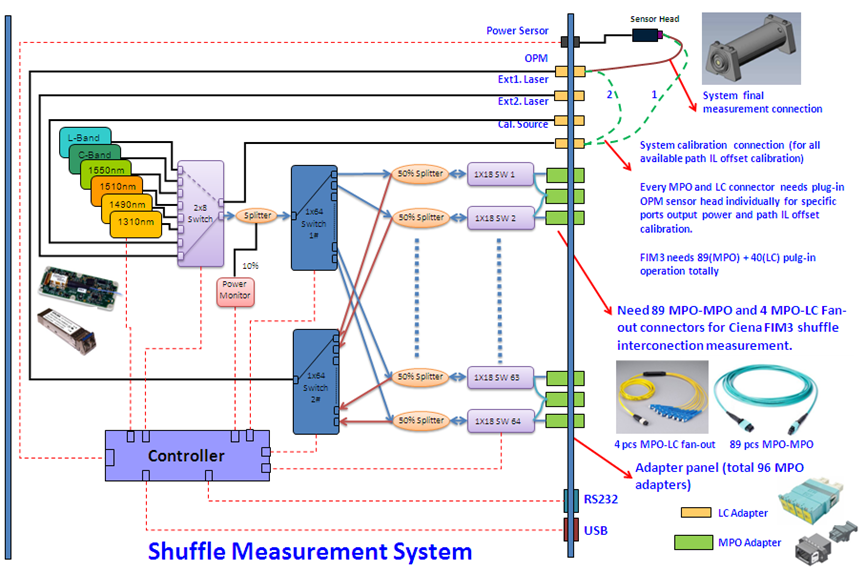
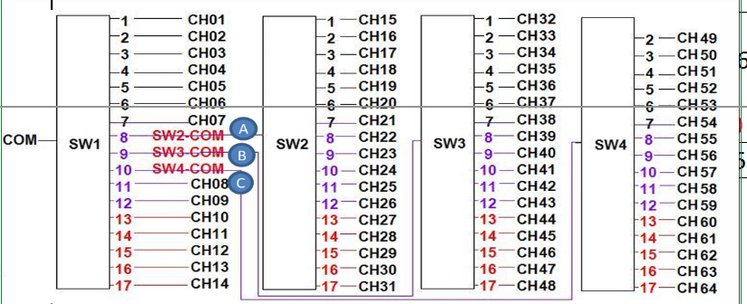

# M576增加1310波长自校准软件 需求Spec PRD

M576增加1310波长自校准软件  **仅增加 1310 一条波长/一套表**

### 背景与目标

- 商业目标：支持 1310 nm 客户/模块、与现有波段共线生产。
- 技术目标：在指定测试环境下，完成各 MEMS 通道在 1310 nm 下的 DAC 定标，并生成/烧录可版本化的 BIN。

## 物理拓扑图

用于多芯（MPO）光通信器件的自动化光路切换 + 功率测量系统，通过大量光开关“洗牌（Shuffle）”光路，用有限的功率计完成大量端口组合的测量与校准

同一套测试系统可覆盖不同光模块标准，避免单一波长的局限

这张图描述的是一个四级级联光开关结构，
 光从 COM 进入 SW1，
 SW1 既可以直接输出，也可以把光送到 SW2、SW3、SW4 作为下一级公共输入，
 从而用多个 1×17 光开关组合出 64 路系统通道。
 每一个 CHxx 都对应一条唯一的光路径，也就是我们校准和测量的最小单元

## 需求描述

重新校准通过功率计，现在需要实现配套上位机，

1) 设置定标路径(1286次)＆目标开关、
2) 读数据＆计算最佳位置点＆对应到开关的定标数据区、
3) 增加每个子模块的读flash功能＆备份旧的BIN文件、
4) 生成新的数据BIN文件＆升级、
5) 验证重复性；

主板FW重新校准所有子模块的Mems Switch,包括1X64(4个1x18Mems Switch),MCS(32个1x18Mems Switch, 1个1X8Mems Switch)

初步设想的校准步骤如下：
1) 校准系统GUI提示用户短接1#MCS短接2#MCS,即短接了32路MPO，共32X18=576条光路;
2) 校准系统GUI发送校准指令给主板，包含输入参数：
　光源通道(1~8)、
    　目标校准开关索引(1~6，依次对应以下各个开关)、
    　1#1x64 Switch_1 Index(0~ 4)、1#1x64 Switch_1 Channel(0~18)、
        1#1x64 Switch_2 Index(0~ 4)、1#1x64 Switch_2 Channel(0~18)、
    　1#MCS  Switch   Index(1~32)、1#MCS  Switch   Channel(1~18)、
    　2#MCS  Switch   Index(1~32)、2#MCS  Switch   Channel(1~18)、
    　2#1x64 Switch_1 Index(0~ 4)、2#1x64 Switch_1 Channel(0~18)、
       2#1x64 Switch_2 Index(0~ 4)、2#1x64 Switch_2 Channel(0~18)、
       calibration delay time(us, read powermeter by RS232)、
       calibration DAC range(1~200,  valid DAC: base_x±range, base_Y±range)、
       calibration DAC step(1~100) 
3) 主板FW收到正确指令后，根据1x64 module mapping设置目标通道、设置MCS目前通道，
再回读目标开关的当前通道(即目标通道)对应的DAC_X_base, DAC_Y_base,
依次设置[DAC_X_base±64, DAC_Y_base±64],主板通过串口依次读取功率点网格（点数与 DAC range/step 及固件定义一致，常见为 64×64 量级），并将该组值回复给校准系统GUI;
4) 校准系统GUI收到功率点序列之后，拟合/寻峰得到最佳光斑中心点（如 max power 对应 DAC），并记录保存
5) 依次重复步骤2)、3)、4)次数=64+3+32×18+32×18+64+3=1286次
6) 校准系统GUI读出每个模块的定标表，并生成BIN文件保存备用
7) 校准系统GUI根据新的定标数据，依次生成新的模块bin，并升级到模块里
8) 校准系统GUI做系统重复性检查，重复性OK才表示该模块重新校准成功，否则校准失败，需恢复旧数据

## 上位机需求细化

### 范围Scope

实现上位机 EXE、

​	与主板协议、功率采集、寻峰算法、读 Flash、BIN 生成与升级、备份与回滚、重复性测试。

### 用户角色与典型流程

- 操作员步骤：短接 → 选波长 1310 → 自动/半自动遍历 → 导出报告 → 判合格。
- 异常：通信失败、功率异常低、重复性超差时的提示与是否恢复旧 BIN。

### 功能需求

- FR-01 参数配置：光源通道 1–8、各开关 index/channel、delay、DAC range/step（与固件一致）。
- FR-02 单次校准：发指令 → 收功率点序列（维数与 range/step 一致）→ 二维寻峰（十字寻峰或 PRD 所述二阶/粗扫+细扫，以固件与算法定稿为准）。
- FR-03 遍历策略：与 1286/2576 对齐；**路径表以 `path_0330`（或导出 CSV）为权威输入**，驱动每步的 target index 与光路参数。
- FR-04 Flash：读各子模块定标表、时间戳/版本号（若有）。
- FR-05 BIN：格式说明（偏移、长度、校验、是否每模块独立文件）；**具体读 Flash / 写 BIN / 升级帧格式以单独《BIN 与升级协议》为准**（本 PRD 仅规定流程责任）。
- FR-06 升级：顺序、校验、失败回滚。
- FR-07 重复性：次数、统计量（均值/标准差）、合格阈值（数值待与规格书对齐后写入）。

### 上位机开发任务清单（细化整合）

以下条目与《Z4744 Firmware Upgrade tips》及 `path_0330` 表一致，作为实现与测试拆分依据。

#### 1. 串口会话与校准主流程

1. **会话初始化**：按方案选择功率计路径或 PD 路径（见下节 `RECAL`），必要时提示用户完成短接、光源与 OPM 连接。
2. **`RECAL 0`（Command A，见下节「主板协议」）**：在一次批量校准开始前发送，配置 **TLS 光源通道（1–8）、波长（nm，如 1310 / 1550）、功率计档位（pm range 0–4）**。**delay、DAC half-range、DAC step 不属于 RECAL 0**，由同一会话中的 **`RECAL 3` / `RECAL 5`** 携带。若 TLS / 波长 / pm range 在整段路径中不变，通常只在循环外发送一次 `RECAL 0`；若路径表或操作需要在运行中切换上述参数，则按固件要求**在变更前重复发送 `RECAL 0`**。
3. **循环体（1286 步或路径表行数）**：对每一步发送 **`RECAL 1` 或 `RECAL 2`**（Command B/C，见下节），再 **`RECAL 3` / `RECAL 5` 扫点**；光路 target 与通道由路径表逐行驱动，**非**单一固化命令重复。
4. **寻峰与写数**：对收到的序列做二维寻峰，得到最优 DAC 或写入中间结果；累积至全部路径完成后，进入 BIN 与升级流程。
5. **方案选择**：**功率计方案**以 `RECAL 1` 为主（四段光路）；**PD 方案**以 `RECAL 2` 为主（两段光路）；是否与 `RECAL 0` 组合、是否允许同会话混用以**固件版本说明**为准。

#### 2. 路径驱动（1286 步）与路由校验

1. **输入源**：使用 Excel 表 **`path_0330`** 或导出的 **CSV**，作为每步的 **target switch index** 与 **光路参数** 的权威来源（与 1286 次循环对齐）。
2. **`RECAL 1`（四元组）**：光路格式为 `[1#1x64 ch][1#MCS ch][2#MCS ch][2#1x64 ch]`，通道范围：1×64 为 1–64，MCS 为 1–18。
3. **`RECAL 2`（二元组，PD 路径）**：光路为 `[2#1x64 ch]` + `[1#MCS ch]` 或 `[2#1x64 ch]` + `[2#MCS ch]`（具体两条定义以固件为准）。
4. **路由合法性校验（上位机必须实现）**：
   - 1#1×64：**ch 1–32 → 1# MCS**；**ch 33–64 → 2# MCS**。
   - 2#1×64：**ch 1–32 → 1# MCS**；**ch 33–64 → 2# MCS**。
   - 与规则不符时：**报错或按项目约定自动修正**，行为写入用户手册。
5. **target switch index 与 PRD 中 1–6 阶段**（1# Stage1/2、1#/2# MCS、2# Stage1/2）保持一致；`RECAL 2` 若仅支持 index 1–4，路径子集须在配置中声明。

#### 3. 期望点数、超时与解析

1. **点数与 DAC range**：扫点总数由固件根据 **DAC range、step** 及二维扫描方式决定；参考 `path_0330` 中 **DAC range（如 8/16/32/64）与 all points（如 256/1024/4096/16384）** 的对应关系计算**期望样本个数**（以固件发布说明为最终依据）。
2. **超时**：单次 `RECAL 1/2` 等待时间 ≥「单点 delay × 期望点数」+ 通信余量；**delay 单位**（文档中曾出现 µs 与 ms）须在联调时与固件统一并在本 PRD 附录中固化。
3. **解析**：按约定分隔符解析功率序列；若分包返回，须实现拼包与序号校验（见接口节）。

#### 4. BIN 备份、生成、烧录与重复性

1. **备份**：升级前读取各子模块定标区（或整镜像）并保存为带时间戳的 BIN。
2. **生成**：根据寻峰结果按 **BIN 布局规格**（见 FR-05 引用文档）生成新文件。
3. **烧录**：按 **《BIN 与升级协议》** 执行顺序烧录；失败时支持回滚至备份。
4. **重复性测试**：校准完成后按 FR-07 执行；阈值与样本数待规格书确认。

#### 5. 固件版本矩阵与安装说明

上位机发布包须在**安装说明 / Release Notes** 中声明兼容的固件组合（与《Z4744 Firmware Upgrade tips》同步），示例：

| 模块 | 固件包/引用 | 发布版本 | 说明 |
|------|-------------|----------|------|
| Controller（429F） | 如 `429F_FW_special_PD_*.7z` | **V3.0.0.4** | 提供 `RECAL` 校准与透传 |
| MCS | `Z4671_1-18SW_*.zip` | **V2.0.0.5** | 1310/1550、定标存储等 |
| 1×64 Switch | Spec **14538** | **V1.0.1.0** | Flash 分区与波长表策略 |
| 1×64 Switch Tester（若使用） | `OE0B_1x64_Switch_Tester_*` | **V2.0.0.0** | 产线治具可选 |

**规则**：主版本升级导致协议或 BIN 布局变更时，同步 bump 上位机版本并在说明中列出**最低固件版本**。

### 接口与依赖

#### 主板串口：`RECAL` 指令（摘要）

- **格式**：`RECAL [type] [para_0] … [para_n]\r`（具体分隔符与参数顺序以固件文档为准）。
- **响应**：功率值序列（长度与当前扫参一致）。

| type | 含义 | 典型参数 |
|------|------|----------|
| **0** | Command A：TLS、波长、功率计档位 | `RECAL 0 <tls 1–8> <wavelength nm> <pm range 0–4>`；与下文「主板协议」Command A 一致 |
| **1** | 功率计路径：目标开关 + **四段**光路 | target index 1–6；`[1#1x64 ch][1#MCS ch][2#MCS ch][2#1x64 ch]` |
| **2** | PD 路径：目标开关 + **两段**光路 | target index 1–4；二元组定义见固件（2#1×64 与 1#/2# MCS） |

扫点延时与 DAC 参数见 **`RECAL 3` / `RECAL 5`**（见「主板协议」Command B/C），不在 type **0** 的 wire 格式中。

- **其它**：串口波特率、帧尾、超时与重试、**是否分包**、错误码，在《主板串口协议》中补全；本 PRD 要求上位机实现**可配置超时**与**日志**（含每步序号与返回长度）。

#### 依赖

- 功率计：**RS232** 命令与单位由 Controller 侧统一读取时序（delay 与功率稳定时间匹配）。
- **BIN / 升级**：独立协议文档；未发布前，开发以固件工程师提供的草案为准。

#### 主板协议

**Command A**

"[Command A: TLS 光源通道 + 校准波长 + 功率计量程]  →(4 字段：`RECAL 0` + 3 个数值参数)

***********************************************************
Cmd: RECAL 0 [set tls source] [wavelength] [pm range]\r
Resp: OK
***********************************************************
tls  source:  1~8 (2x8 switch channel)
walength :  850~1650(TBD)
[pm range]: 
0->  6   ~ -14 dBm
1-> -14 ~ -34dBm
2-> -34 ~ -54dBm
3-> -54 ~ -75dBm
4-> auto range

**Command B**

"[Command B: 选择功率计描点，设置目标开关、定标光路(4 switch)]  →(6 parameter)

*********************************************************************************************************
Cmd: RECAL 1 [set target switch index] [optical path(4 data, switch channel)...]
Resp: OK
*********************************************************************************************************
X轴不动，Y轴描点：
Cmd: RECAL 3 0 [Base DAC] [Offset DAC] [Step DAC] [Delay time]\r
Resp:[X start] [P1]....[Pn]
**********************************************************************************************************
Y轴不动，Y轴描点：
Cmd: RECAL 3 1 [Base DAC] [Offset DAC] [Step DAC] [Delay time]\r
Resp:[Y start] [P1]....[Pn]
**********************************************************************************************************
[Base DAC]: 
9999   - FW读通道DAC为基值
other - FW设置该值  

target switch index: 1~6 
1: 1#1x64 Stage_1 switch Index
2: 1#1x64 Stage_2 switch Index
3: 1#MCS  Switch   Index(1~32)
4: 2#MCS  Switch   Index(1~32)
5: 2#1x64 Stage_1  switch Index
6: 2#1x64 Stage_2  switch Index

optical path: [1#1x64 ch] [1#MCS ch][2#MCS ch][2#1x64 ch]
[1#1x64 ch]: 1~64
[1#MCS ch]: 1~18
[2#MCS ch]: 1~18
[2#1x64 ch]: 1~64

1#1x64 ch1  ~ch32 -> 1# MCS
1#1x64 ch33~ch64 -> 2# MCS
2#1x64 ch1  ~ch32 -> 1# MCS
2#1x64 ch33~ch64 -> 2# MCS

delay time: 20~100ms
dac  range: 1~200 (valid DAC: base_x±range, base_Y±range)
dac    step : 1~100"

**Command C**

"[Command C: 选择PD描点，设置目标开关、定标光路(2 switch)] 

****************************************************************************************************************
Cmd: RECAL 2 [set target switch index] [optical path(2 data, switch channel)...]\r
Resp: OK
****************************************************************************************************************
X轴不动，Y轴描点：
Cmd: RECAL 5 0 [Base DAC] [Offset DAC] [Step DAC] [Delay time]\r
Resp:[X start] [P1]....[Pn]
****************************************************************************************************************
Y轴不动，Y轴描点：
Cmd: RECAL 5 1 [Base DAC] [Offset DAC] [Step DAC] [Delay time]\r
Resp:[Y start] [P1]....[Pn]
****************************************************************************************************************

2x8 Switch to'Ext1.Laser',connect to 'OPM' 

target switch index: 1~4 
1: 2#1x64 Stage_1 switch Index
2: 2#1x64 Stage_2 switch Index
3: 1#MCS  Switch   Index(1~32)
4: 2#MCS  Switch   Index(1~32)

optical path 1: [2#1x64 ch] [1#MCS ch]
optical path 2: [2#1x64 ch] [2#MCS ch]
[2#1x64 ch]: 1~64
[1#MCS ch]: 1~18
[2#MCS ch]: 1~18

2#1x64 ch1  ~ch32 -> 1# MCS
2#1x64 ch33~ch64 -> 2# MCS"

### 算法说明

- 输入：DAC 网格与功率矩阵（或等效一维序列按行列还原）。
- 输出：最优 (DAC_X, DAC_Y) 或下一步细扫中心。
- 明确：**十字寻峰**（先一行找 max 再一列）

### BIN 布局与升级协议

1310数据覆盖原1550的低温

复用 Z4671 的 BIN 结构与写文件逻辑；在数据结构里把 1310 定标只写入 `IDX_TEMP_LOW` **对应的 `wCalibPtrDAC`（及必要元数据），实现「1310 数据覆盖原 1550 低温槽」；1550 继续用室温档，升级前合并旧 BIN 以免误删其它温度点

### 验收标准

1. **协议与路径**：能按 `path_0330`（或等价 CSV）完成**不少于 1286 步**配置中的全部路径（以表为准），`RECAL 0/1` 或 `RECAL 0/2` 与固件联调通过。
2. **校验逻辑**：故意输入违反 1×64↔MCS 路由规则的四元组/二元组时，软件行为符合「上位机开发任务清单」第 2 节约定。
3. **数据完整性**：每次 `RECAL 1/2` 返回的功率个数与所选 DAC range/step 及固件说明一致；超时与重试可配置。
4. **BIN 与升级**：在《BIN 与升级协议》齐备后，完成备份 → 生成 → 烧录 → 失败回滚的闭环测试。
5. **重复性**：满足 FR-07 中最终确认的阈值与次数。
6. **版本**：安装说明中固件版本矩阵与实测组合一致。

